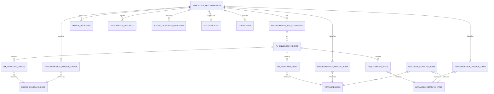

# 📊 ANÁLISE COMPLETA DA ESTRUTURA DO BANCO DE DADOS

## 📋 Resumo Executivo

O banco de dados **usuarios.db** é um sistema SQLite3 robusto para gestão de processos e procedimentos disciplinares da Polícia Militar. Contém **28 tabelas** interconectadas que gerenciam todo o fluxo de processos administrativos, controle de usuários, auditoria e indícios disciplinares.

---

## 🗂️ Estrutura das Tabelas

### 1. **TABELAS DE USUÁRIOS E ACESSO**

#### 1.1 `usuarios` (7 registros)
Tabela legada de usuários do sistema.
- **Campos principais**: id, nome, email, senha, is_admin, data_criacao, ativo
- **Propósito**: Controle de acesso inicial (aparentemente substituída por operadores)

#### 1.2 `operadores` (5 registros)
Usuários operacionais do sistema com permissões específicas.
- **Campos principais**: id (UUID), posto_graduacao, matricula, nome, email, senha, profile, ativo
- **Perfis**: admin, operador
- **Relacionamento**: Pode ser escrivão em processos

#### 1.3 `encarregados` (20 registros)
Policiais militares que podem ser encarregados de processos/procedimentos.
- **Campos principais**: id (UUID), posto_graduacao, matricula, nome, email, ativo
- **Uso**: Responsáveis pelos processos disciplinares

---

### 2. **TABELAS PRINCIPAIS DE PROCESSOS**

#### 2.1 `processos_procedimentos` (58 registros) ⭐ **TABELA CENTRAL**
Tabela principal que armazena todos os processos e procedimentos.

**Campos de Identificação:**
- `id` (UUID): Identificador único
- `numero`: Número sequencial
- `numero_controle`: Número de controle adicional
- `processo_sei`: Número do processo no SEI
- `numero_portaria`, `numero_memorando`, `numero_feito`, `numero_rgf`: Documentos relacionados

**Classificação:**
- `tipo_geral`: 'processo' ou 'procedimento'
- `tipo_detalhe`: PAD, PCD, IPM, SINDICANCIA, etc.
- `documento_iniciador`: Portaria, Memorando Disciplinar, Feito Preliminar

**Responsáveis:**
- `responsavel_id` + `responsavel_tipo`: Encarregado ou Operador responsável
- `escrivao_id`: Referência ao operador escrivão
- `nome_pm_id`: PM envolvido principal

**Datas Importantes:**
- `data_instauracao`: Data de instauração
- `data_recebimento`: Data de recebimento
- `data_remessa_encarregado`: Remessa ao encarregado
- `data_conclusao`: Data de conclusão
- `data_julgamento`: Data do julgamento

**Dados do Caso:**
- `local_origem`: Unidade de origem (CORREGEPOM, 6ºBPM, etc.)
- `local_fatos`: Município onde ocorreram os fatos
- `nome_vitima`: Nome da vítima (quando aplicável)
- `resumo_fatos`: Descrição dos fatos
- `status_pm`: Status do PM (Acusado, Indiciado, Sindicado)

**Natureza e Infrações:**
- `natureza_processo`: Natureza do processo
- `natureza_procedimento`: Natureza do procedimento
- `transgressoes_ids`: JSON com IDs das transgressões
- `infracao_id`: ID da infração principal
- `indicios_categorias`: Categorias de indícios encontrados

**Conclusão:**
- `concluido`: Boolean indicando se está concluído
- `solucao_final`: Texto da solução final
- `solucao_tipo`: Tipo de solução aplicada
- `penalidade_tipo`: Tipo de penalidade
- `penalidade_dias`: Dias de penalidade

**Controle:**
- `ano_instauracao`: Ano para controle
- `ativo`: Status ativo/inativo
- `created_at`, `updated_at`: Timestamps

---

### 3. **TABELAS DE PMs ENVOLVIDOS**

#### 3.1 `procedimento_pms_envolvidos` (58 registros)
Relaciona múltiplos PMs a um procedimento.
- **Campos**: id, procedimento_id, pm_id, pm_tipo, ordem, status_pm
- **Propósito**: Permite múltiplos PMs por procedimento

#### 3.2 `pm_envolvido_indicios` (6 registros)
Indícios específicos por PM envolvido.
- **Campos**: id, procedimento_id, pm_envolvido_id, categorias_indicios, categoria
- **Relaciona com**: pm_envolvido_crimes, pm_envolvido_rdpm, pm_envolvido_art29

#### 3.3 `pm_envolvido_crimes` (2 registros)
Crimes associados a cada PM.
- **FK**: pm_indicios_id → pm_envolvido_indicios, crime_id → crimes_contravencoes

#### 3.4 `pm_envolvido_rdpm` (4 registros)
Transgressões RDPM por PM.
- **FK**: pm_indicios_id → pm_envolvido_indicios, transgressao_id → transgressoes

#### 3.5 `pm_envolvido_art29` (0 registros)
Infrações do Art. 29 do Estatuto por PM.
- **FK**: pm_indicios_id → pm_envolvido_indicios, art29_id → infracoes_estatuto_art29

---

### 4. **TABELAS DE INFRAÇÕES E NORMAS**

#### 4.1 `transgressoes` (93 registros)
Catálogo de transgressões disciplinares do RDPM.
- **Campos**: id, gravidade (leve/média/grave), inciso, texto
- **Exemplo**: "portar-se inconvenientemente..."

#### 4.2 `crimes_contravencoes` (22 registros)
Catálogo de crimes e contravenções penais.
- **Campos**: tipo, dispositivo_legal, artigo, descricao_artigo, paragrafo, inciso, alinea
- **Exemplo**: Art. 121 CP - "Matar alguém"

#### 4.3 `infracoes_estatuto_art29` (21 registros)
Infrações do Art. 29 do Estatuto dos Militares.
- **Campos**: id, inciso, texto
- **Exemplo**: "amar a verdade e a responsabilidade..."

#### 4.4 `analogias_estatuto_rdpm` (0 registros)
Relaciona infrações do Art. 29 com transgressões do RDPM.
- **FK**: art29_id, rdpm_id

---

### 5. **TABELAS DE INDÍCIOS DOS PROCEDIMENTOS**

#### 5.1 `procedimentos_indicios_crimes` (4 registros)
Crimes identificados no procedimento.
- **FK**: procedimento_id, crime_id
- **Índice único**: (procedimento_id, crime_id)

#### 5.2 `procedimentos_indicios_rdpm` (3 registros)
Transgressões RDPM identificadas.
- **FK**: procedimento_id, transgressao_id
- **Índice único**: (procedimento_id, transgressao_id)

#### 5.3 `procedimentos_indicios_art29` (2 registros)
Infrações Art. 29 identificadas.
- **FK**: procedimento_id, art29_id
- **Índice único**: (procedimento_id, art29_id)

---

### 6. **TABELAS DE CONTROLE E PRAZOS**

#### 6.1 `prazos_processo` (3 registros)
Gerencia prazos e prorrogações.
- **Campos principais**: 
  - processo_id, tipo_prazo (inicial/prorrogacao)
  - data_inicio, data_vencimento
  - dias_adicionados, motivo
  - numero_portaria, data_portaria
  - ordem_prorrogacao
- **Índice único**: Apenas um prazo ativo por processo

#### 6.2 `andamentos_processo` (0 registros)
Movimentações do processo.
- **Campos**: data_movimentacao, tipo_andamento, descricao, destino_origem

#### 6.3 `status_detalhado_processo` (0 registros)
Histórico de mudanças de status.
- **Campos**: status_codigo, data_alteracao, observacoes
- **Índice único**: Apenas um status ativo por processo

---

### 7. **TABELAS DE REFERÊNCIA**

#### 7.1 `postos_graduacoes` (12 registros)
Hierarquia militar (CEL PM até SD PM).
- **Campos**: codigo, descricao, tipo (oficial/praca), ordem_hierarquica

#### 7.2 `tipos_processo` (6 registros)
Tipos disponíveis de processos/procedimentos.
- PAD, PCD, SINDICANCIA, IPM, etc.

#### 7.3 `status_processo` (7 registros)
Estados possíveis dos processos.
- INICIADO, EM_ANDAMENTO, CONCLUIDO, etc.
- Inclui cor para interface

#### 7.4 `naturezas` (8 registros)
Naturezas dos processos/procedimentos.
- Abuso de Autoridade, Violação de Direitos, etc.

#### 7.5 `locais_origem` (6 registros)
Unidades militares de origem.
- 1º BPM, 2º BPM, BOPE, ROTAM, etc.

#### 7.6 `municipios_distritos` (112 registros)
Municípios e distritos de Rondônia.
- Hierarquia: município → distrito

---

### 8. **TABELAS DE SISTEMA**

#### 8.1 `auditoria` (93 registros)
Log completo de todas as operações.
- **Campos**: tabela, registro_id, operacao (INSERT/UPDATE/DELETE)
- **Dados**: dados_antes, dados_depois (JSON)
- **Triggers automáticos** para encarregados, operadores e processos

#### 8.2 `schema_migrations` (12 registros)
Controle de migrações executadas.
- **Campos**: migration_name, executed_at, execution_time_ms, success

#### 8.3 `sqlite_sequence` (4 registros)
Controle de auto-increment do SQLite.

---

## 🔗 Relacionamentos Principais

### Diagrama de Relacionamentos (ER)

### Relacionamentos Detalhados

1. **Processo → Responsáveis**
   - Um processo tem UM encarregado responsável (encarregados ou operadores)
   - Um processo pode ter UM escrivão (operadores)

2. **Processo → PMs Envolvidos**
   - Um processo pode ter MÚLTIPLOS PMs envolvidos
   - Cada PM envolvido pode ter status diferente (Indiciado, Sindicado, Acusado)

3. **Processo → Indícios Gerais**
   - Um processo pode identificar MÚLTIPLOS crimes
   - Um processo pode identificar MÚLTIPLAS transgressões RDPM
   - Um processo pode identificar MÚLTIPLAS infrações Art. 29

4. **PM Envolvido → Indícios Específicos**
   - Cada PM pode ter indícios específicos diferentes
   - Indícios podem ser: crimes, transgressões RDPM ou infrações Art. 29

5. **Processo → Controle**
   - Um processo tem MÚLTIPLOS prazos (inicial + prorrogações)
   - Um processo tem MÚLTIPLOS andamentos
   - Um processo tem HISTÓRICO de status

---

## 📈 Estatísticas do Banco

### Volume de Dados
- **Total de tabelas**: 28
- **Total de registros**: ~500 registros
- **Tabela mais populosa**: `municipios_distritos` (112 registros)
- **Processos/Procedimentos ativos**: 58

### Índices
- **Total de índices**: 72 índices criados
- **Tipos**: Índices simples, compostos e únicos
- **Otimizações**: Índices em foreign keys, campos de busca e timestamps

### Integridade
- **Foreign Keys**: 25 relacionamentos definidos
- **Constraints**: CHECK constraints em campos enum
- **Triggers**: 6 triggers de auditoria automática

---

## 🔐 Recursos de Segurança

1. **Auditoria Completa**
   - Todos os INSERT, UPDATE, DELETE são registrados
   - Armazena estado antes/depois em JSON
   - Rastreamento de usuário, IP e timestamp

2. **Controle de Acesso**
   - Separação entre operadores e encarregados
   - Perfis de usuário (admin, operador)
   - Campos de ativo/inativo para soft delete

3. **Integridade Referencial**
   - Foreign keys garantem consistência
   - Constraints verificam valores válidos
   - Índices únicos previnem duplicatas

---

## 🚀 Funcionalidades Principais

### 1. Gestão de Processos Disciplinares
- Cadastro completo de processos e procedimentos
- Múltiplos tipos (PAD, PCD, IPM, Sindicância)
- Controle de responsáveis e escrivães

### 2. Gestão de PMs Envolvidos
- Múltiplos PMs por processo
- Status individualizado por PM
- Indícios específicos por envolvido

### 3. Catalogação de Infrações
- Base completa de transgressões RDPM
- Crimes e contravenções penais
- Infrações do Estatuto Militar

### 4. Controle de Prazos
- Prazo inicial automático
- Múltiplas prorrogações
- Controle por portarias

### 5. Rastreabilidade
- Auditoria completa de alterações
- Histórico de movimentações
- Mudanças de status documentadas

---

## 🔄 Fluxo de Dados Típico

1. **Instauração**
   - Criação do processo em `processos_procedimentos`
   - Atribuição de encarregado responsável
   - Registro automático em `auditoria`

2. **Investigação**
   - Adição de PMs em `procedimento_pms_envolvidos`
   - Identificação de indícios gerais do procedimento
   - Associação de indícios específicos por PM

3. **Prazos**
   - Criação de prazo inicial
   - Prorrogações conforme necessário
   - Controle de vencimentos

4. **Conclusão**
   - Atualização de campos de conclusão
   - Registro de solução final e penalidades
   - Histórico mantido em auditoria

---

## 📝 Observações Importantes

1. **UUID como Primary Key**: Maioria das tabelas usa UUID (TEXT) como chave primária
2. **Soft Delete**: Uso de campo `ativo` ao invés de DELETE físico
3. **JSON Storage**: Alguns campos armazenam JSON (transgressoes_ids, indicios_categorias)
4. **Timestamps**: Todas as tabelas principais têm created_at/updated_at
5. **Case Sensitivity**: Nomes em UPPERCASE para PMs (convenção militar)

---

## 🎯 Conclusão

O banco de dados apresenta uma arquitetura robusta e bem normalizada, adequada para um sistema de gestão de processos disciplinares militares. Os principais pontos fortes são:

- ✅ **Normalização adequada** sem redundâncias
- ✅ **Relacionamentos bem definidos** com FKs
- ✅ **Auditoria completa** para compliance
- ✅ **Flexibilidade** para múltiplos envolvidos e indícios
- ✅ **Escalabilidade** com índices otimizados
- ✅ **Integridade** garantida por constraints

O sistema está preparado para gerenciar todo o ciclo de vida de processos disciplinares, desde a instauração até a conclusão, com rastreabilidade completa.
