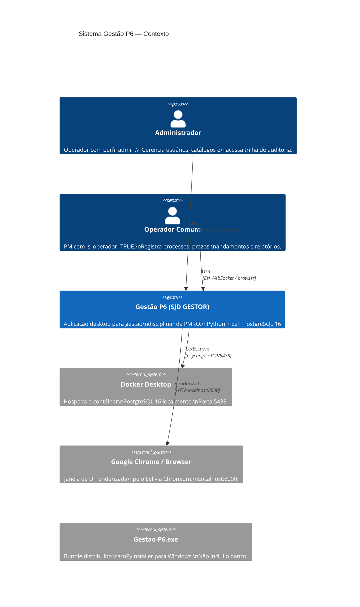

# C4 — Nível 1: Contexto do Sistema

> Gerado pelo Arquiteto em 2026-05-12

---

## Diagrama

---

## Notas

- **Single-user por instância:** a sessão é uma variável global em memória (`usuario_logado`). Apenas um usuário pode estar logado por processo Python.
- **Sem internet:** nenhuma chamada externa. Todos os dados ficam no banco local.
- **Dependência de runtime:** o Docker precisa estar rodando antes de abrir o `.exe`. Não há PostgreSQL embarcado.
- **Modo de janela:** tenta Chrome primeiro; cai para o browser padrão do SO se Chrome não for encontrado.
