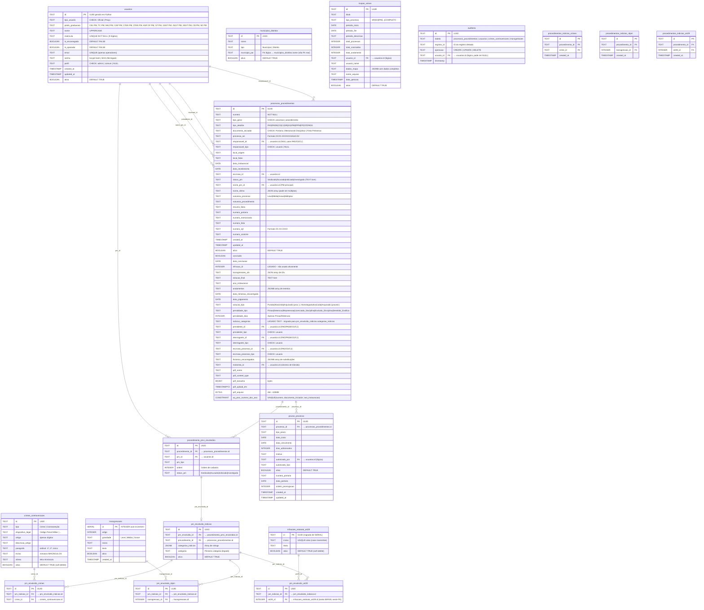

# ERD Completo — Gestão P6

> Gerado pelo Arquiteto em 2026-05-12
> 🟢 = confirmado no schema/código | 🟡 = inferido

---

## Diagrama ERD

---

## Observações sobre o Schema

| Observação | Confiança |
|-----------|-----------|
| FKs são lógicas (não declaradas como FOREIGN KEY no DDL) — sem CASCADE | 🟢 CONFIRMADO |
| `transgressoes.id` é SERIAL; todas as outras entidades principais usam UUID (TEXT) | 🟢 CONFIRMADO |
| `infracoes_estatuto_art29.id` foi migrado de SERIAL para UUID (migration commit `76cb813`) | 🟢 CONFIRMADO |
| `processos_procedimentos.andamentos` e `historico_encarregados` são TEXT/JSONB inline | 🟢 CONFIRMADO |
| Tabelas `procedimentos_indicios_*` existem e devem ser incluídas na migração Rust/Tauri, apesar de não haver uso ativo confirmado no código Python analisado | 🟢 CONFIRMADO pelo usuário (`questions.md#5`) |
| `municipios_distritos.municipio_pai` é uma FK lógica por nome, não por ID | 🟢 CONFIRMADO |
| Não há índices explícitos além dos criados em `0004_add_indexes.py` | 🟢 CONFIRMADO |
