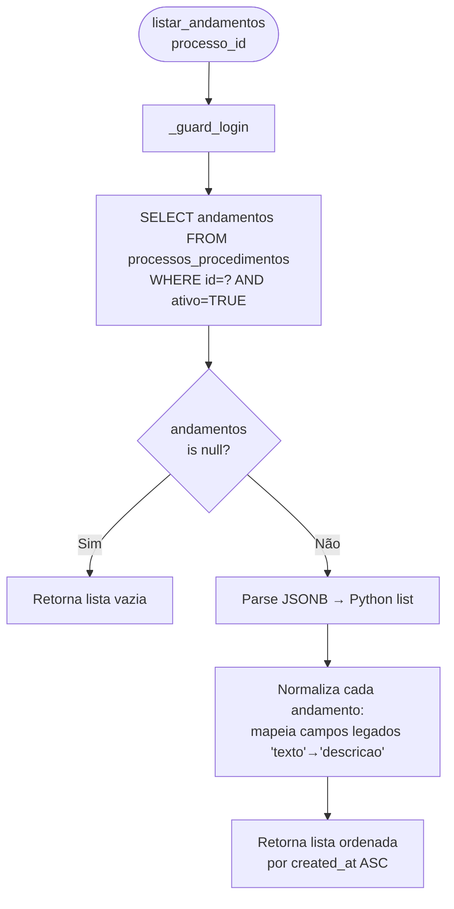
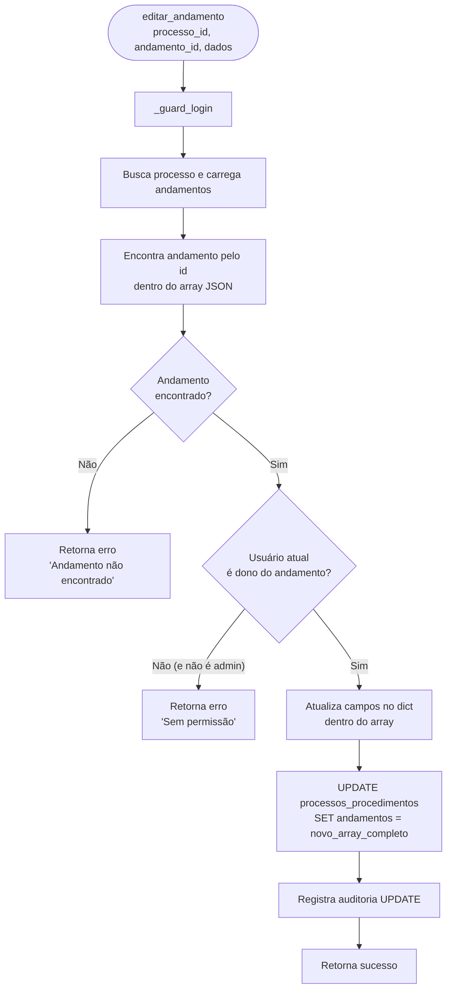
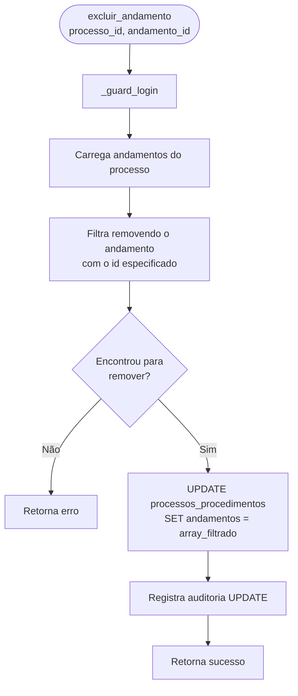
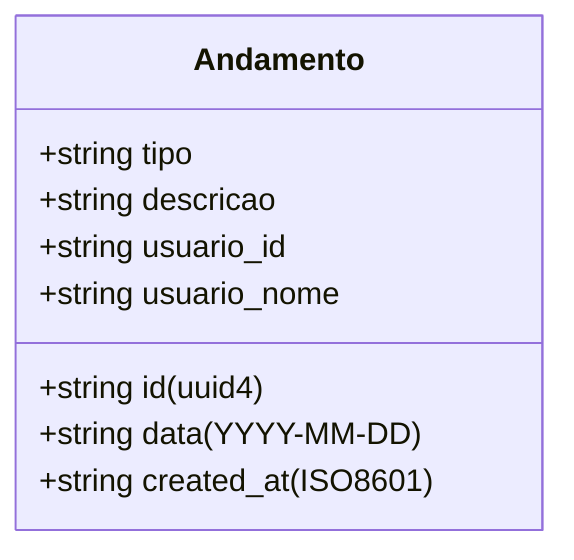

# Flowchart — Módulo andamentos

> Gerado pelo Arqueólogo em 2026-05-12
> Fonte: `app/routers/andamentos.py`, `app/services/prazos_andamentos.py`

---

## Arquitetura de Dados

> Andamentos **não são uma tabela separada**. São armazenados como JSONB array na coluna
> `processos_procedimentos.andamentos`. Cada operação faz UPDATE na linha do processo.

---

## Fluxo: Adicionar Andamento (`adicionar_andamento`)

```mermaid
flowchart TD
    A([adicionar_andamento\nprocesso_id, tipo, descricao]) --> B[_guard_login]
    B --> C{tipo e descricao\npreenchidos?}
    C -- Não --> D[Retorna erro\n'Campos obrigatórios']
    C -- Sim --> E[Busca processo\nWHERE id=? AND ativo=TRUE]
    E --> F{Processo\nencontrado?}
    F -- Não --> G[Retorna erro]
    F -- Sim --> H[Cria dict andamento:\nid=uuid4, data=hoje,\ntipo, descricao,\nusuario_id, usuario_nome,\ncreated_at=now]
    H --> I[Normaliza campos:\nverifica se usa 'tipo' ou 'descricao'\nou 'texto' legado]
    I --> J[UPDATE processos_procedimentos\nSET andamentos = andamentos || '[{...}]'::jsonb\nWHERE id=?]
    J --> K[Registra auditoria UPDATE]
    K --> L[Retorna sucesso + andamento]
```

---

## Fluxo: Listar Andamentos (`listar_andamentos`)



---

## Fluxo: Editar Andamento (`editar_andamento`)



---

## Fluxo: Excluir Andamento (`excluir_andamento`)



---

## Estrutura JSON de um Andamento



> 🟢 CONFIRMADO: andamentos são JSONB array na coluna `processos_procedimentos.andamentos`
> 🟡 INFERIDO: edição restrita ao autor (ou admin) — verificado na camada Python, não no banco
> 🔴 LACUNA: campo legado 'texto' vs 'descricao' — normalização necessária em dados existentes
