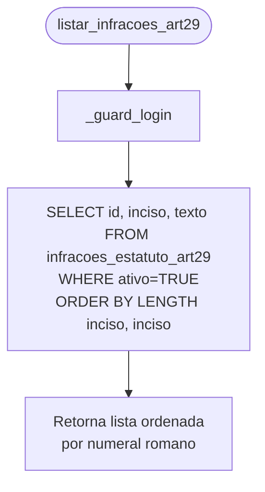
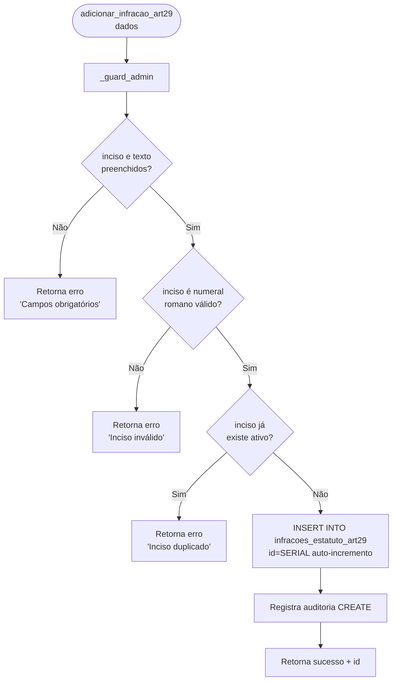
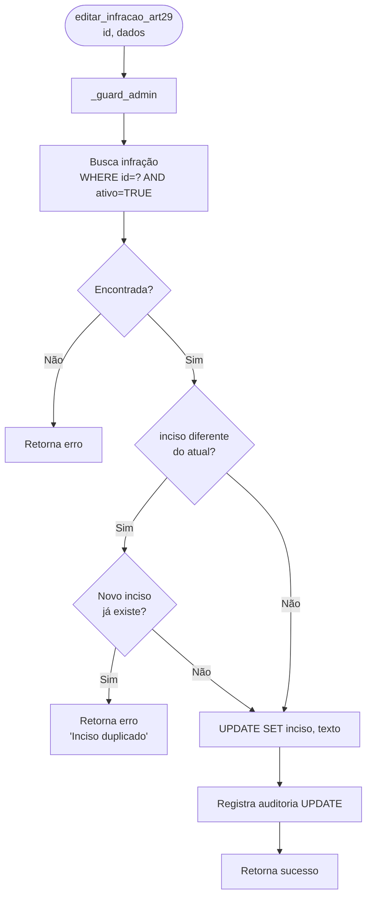
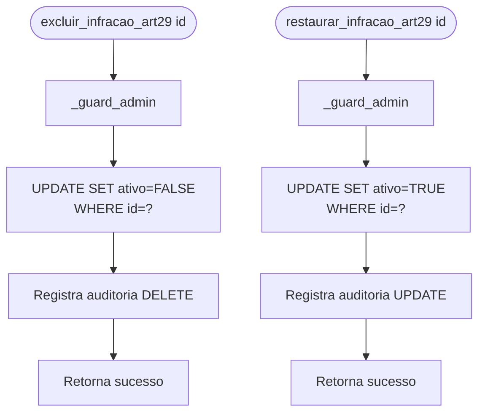
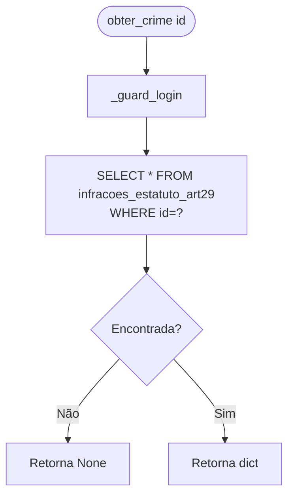

# Flowchart — Módulo art29

> Gerado pelo Arqueólogo em 2026-05-12
> Fonte: `app/routers/art29.py`, `app/art29.py`

---

## Fluxo: Listar Infrações Art.29

> **Nota ordenação**: `ORDER BY LENGTH(inciso), inciso` funciona para I..X mas falha para XI, XII... pois LENGTH(XI)=2 = LENGTH(IX)=2 mas ordem alfabética os inverte.

---

## Fluxo: Adicionar Infração

---

## Fluxo: Editar Infração

---

## Fluxo: Excluir/Restaurar Infração

---

## Fluxo: Obter por ID (`obter_crime`)

> 🟢 CONFIRMADO: soft delete (ativo=FALSE) — diferente do RDPM que usa hard delete
> 🟡 INFERIDO: ordenação por romano pode falhar a partir do inciso XI
