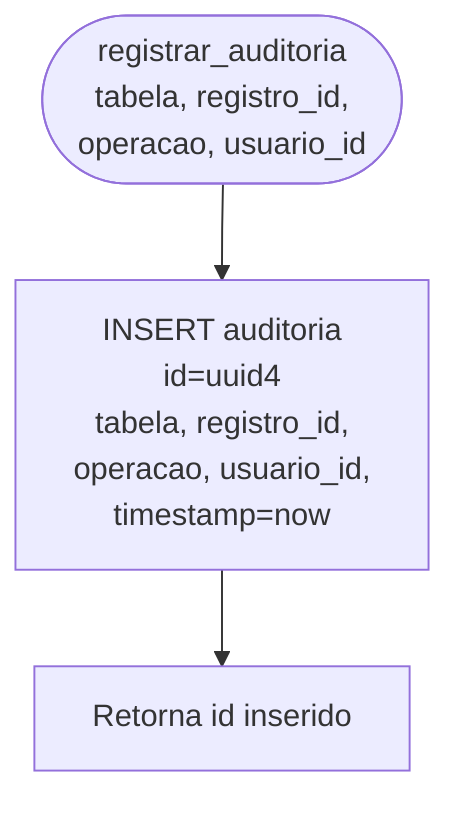
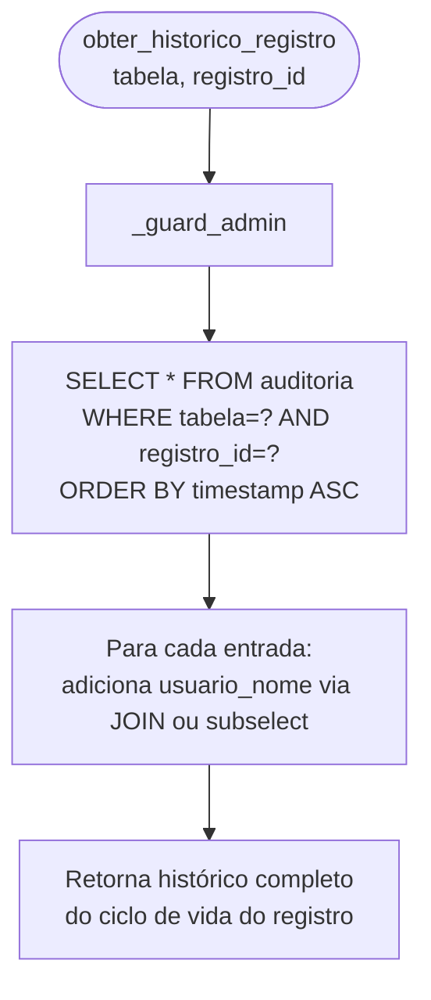
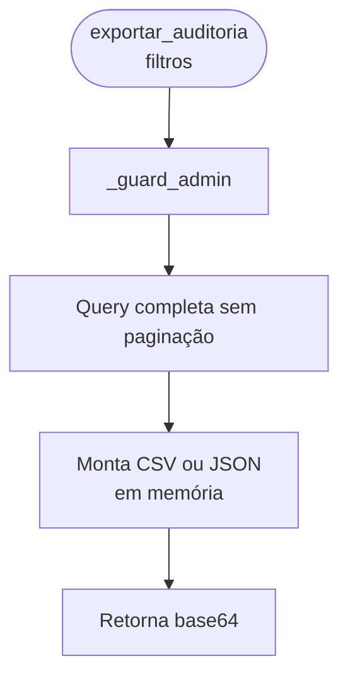

# Flowchart — Módulo auditorias

> Gerado pelo Arqueólogo em 2026-05-12
> Fonte: `app/routers/auditorias.py`, `app/services/auditorias.py`

---

## Fluxo: Registrar Auditoria (interno)



> Chamado internamente por todos os módulos após operações de escrita.
> Não é uma função @eel.expose — é utilitário interno.

---

## Fluxo: Listar Trilha de Auditoria (`listar_auditoria`)

```mermaid
flowchart TD
    A([listar_auditoria\npagina, por_pagina,\nfiltros]) --> B[_guard_admin]
    B --> C[Monta WHERE dinâmico:\ntabela?, operacao?,\nusuario_id?, data_inicio?,\ndata_fim?]
    C --> D[COUNT total de registros\ncom os filtros]
    D --> E[SELECT auditoria\nWITH JOIN usuarios\npara usuario_nome]
    E --> F[LIMIT por_pagina\nOFFSET pagina*por_pagina\nORDER BY timestamp DESC]
    F --> G[Retorna:\n{registros: [...], total, pagina, por_pagina}]
```

---

## Algoritmo de Paginação

```mermaid
flowchart TD
    A([paginação]) --> B[total = COUNT query]
    B --> C[offset = pagina * por_pagina]
    C --> D[total_paginas = ceil(total / por_pagina)]
    D --> E[Retorna metadados:\ntotal, total_paginas,\npagina_atual, por_pagina]
```

---

## Fluxo: Obter Histórico de Registro Específico



---

## Fluxo: Exportar Auditoria (`exportar_auditoria`)



---

## Operações Rastreadas no Sistema

| Módulo | Operações registradas |
|--------|----------------------|
| auth | LOGIN, LOGOUT |
| usuarios | CREATE, UPDATE, DELETE |
| processos | CREATE, UPDATE, DELETE |
| prazos | CREATE, UPDATE |
| andamentos | UPDATE (processo com andamentos) |
| indicios | CREATE, DELETE |
| mapas | CREATE, DELETE |
| rdpm | CREATE, UPDATE, DELETE |
| art29 | CREATE, UPDATE, DELETE |
| catalogos | CREATE, UPDATE, DELETE |

> 🟢 CONFIRMADO: acesso exclusivo para admin
> 🟢 CONFIRMADO: paginação via LIMIT/OFFSET
> 🟡 INFERIDO: dados de auditoria são imutáveis (sem UPDATE ou DELETE na tabela auditoria)
> 🔴 LACUNA: sem retenção ou arquivamento — tabela cresce indefinidamente
