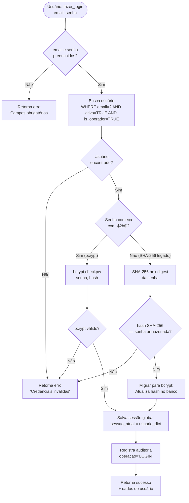
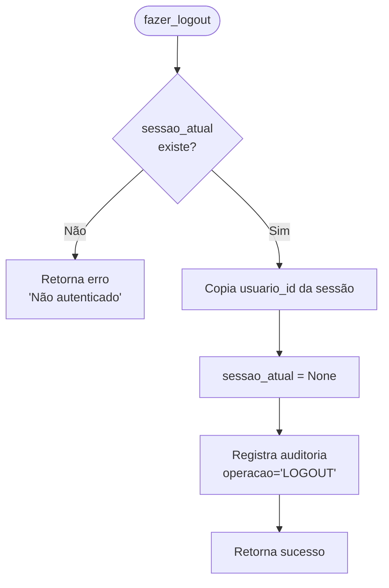
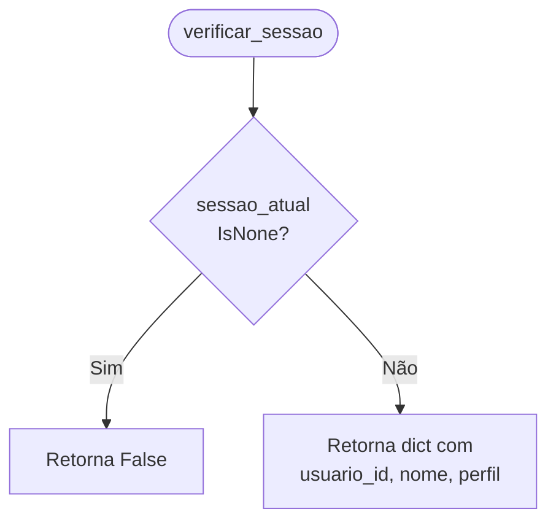
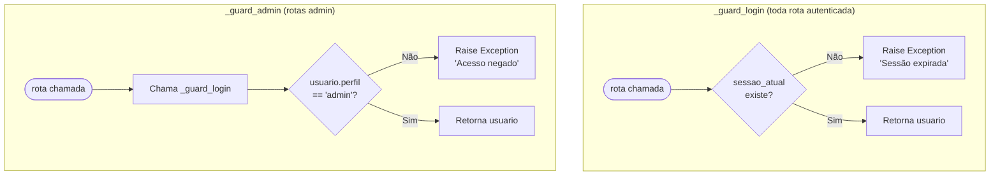
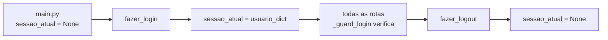

# Flowchart — Módulo auth

> Gerado pelo Arqueólogo em 2026-05-12
> Fonte: `app/routers/auth.py`, `main.py`

---

## Fluxo principal: Login (`fazer_login`)

---

## Fluxo: Logout (`fazer_logout`)

---

## Fluxo: Verificar Sessão (`verificar_sessao`)

---

## Guards de Autorização

---

## Mecanismo de Sessão

> 🟡 INFERIDO: sessão é variável global em memória. Não persiste entre reinicializações do app.
> 🔴 LACUNA: sem timeout de sessão implementado.
