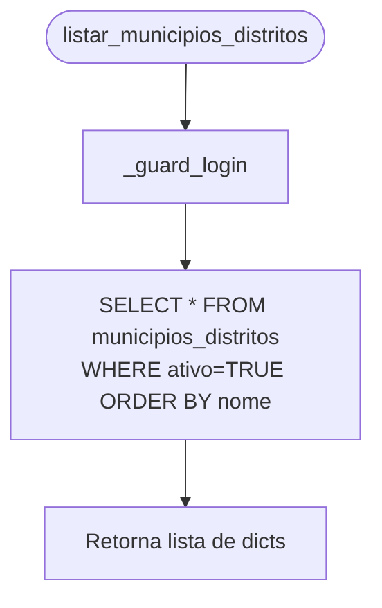
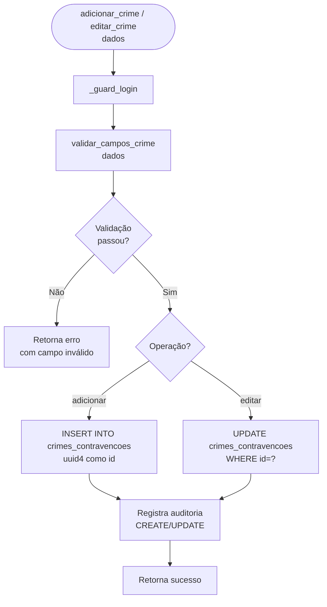
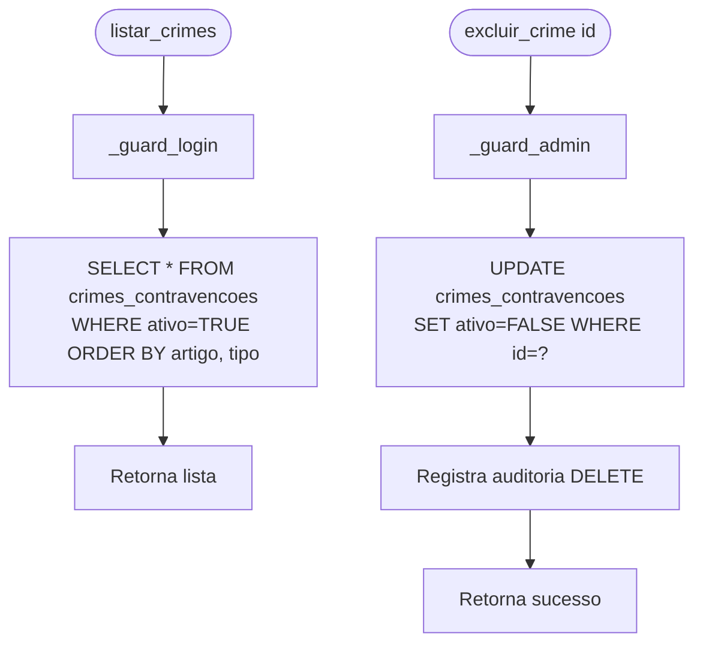

# Flowchart — Módulo catalogos

> Gerado pelo Arqueólogo em 2026-05-12
> Fonte: `app/routers/catalogos.py`, `app/catalogos.py`, `app/utils.py`

---

## Fluxo: Listar Municípios e Distritos (`listar_municipios_distritos`)



---

## Fluxo: Gerenciar Crime (`adicionar_crime`, `editar_crime`)



---

## Algoritmo: validar_campos_crime

```mermaid
flowchart TD
    A([validar_campos_crime\ndados]) --> B{artigo\npreenchido?}
    B -- Não --> C[Retorna erro\n'artigo obrigatório']
    B -- Sim --> D{artigo match\n'^\d+minus-A $'?}
    D -- Não --> E[Retorna erro\n'artigo inválido']
    D -- Sim --> F{parágrafo\npreenchido?}
    F -- Não --> G[OK - segue]
    F -- Sim --> H{paragrafo match\n'^§\d+|caput|\d+º $'?}
    H -- Não --> I[Retorna erro\n'parágrafo inválido']
    H -- Sim --> G
    G --> J{inciso\npreenchido?}
    J -- Não --> K[OK - segue]
    J -- Sim --> L{inciso match\nnumeral romano?}
    L -- Não --> M[Retorna erro\n'inciso inválido']
    L -- Sim --> K
    K --> N{alínea\npreenchida?}
    N -- Não --> O[Retorna None - válido]
    N -- Sim --> P{alínea match\n'^a-z $'?}
    P -- Não --> Q[Retorna erro\n'alínea inválida']
    P -- Sim --> O
```

---

## Fluxo: Listar/Excluir Crime



> 🟢 CONFIRMADO: crimes/contravenções usam soft delete (ativo=FALSE)
> 🟢 CONFIRMADO: validação de campos via regex em app/utils.py
