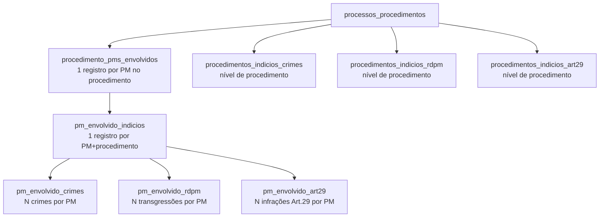
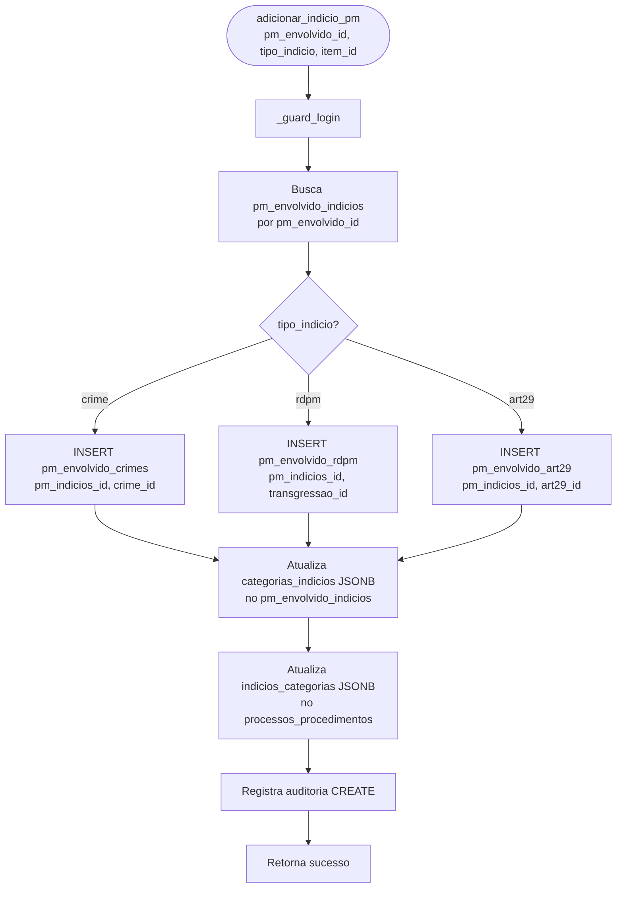
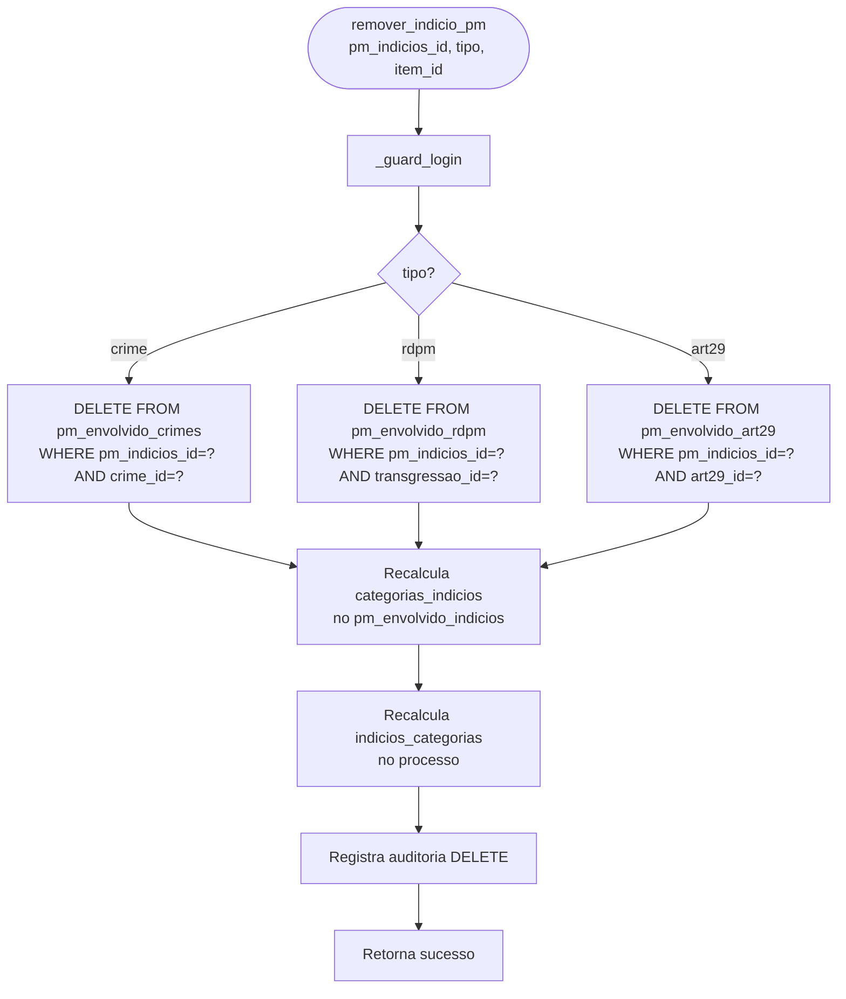
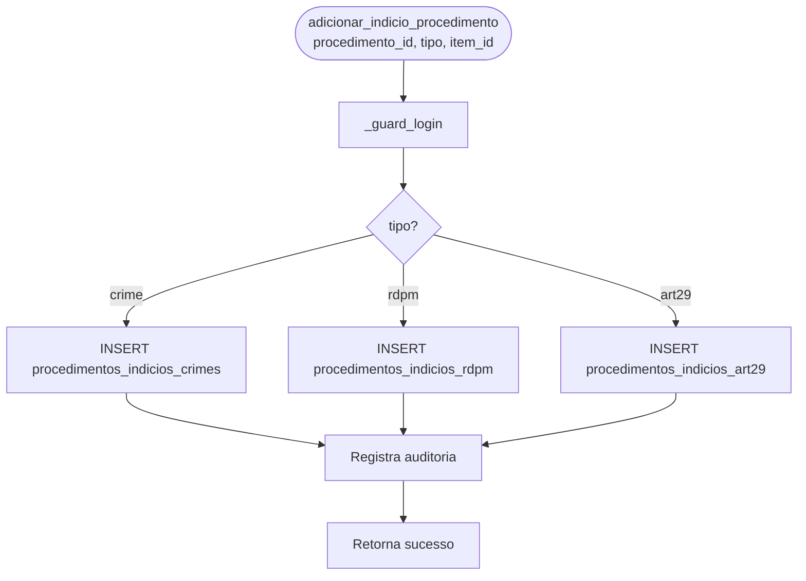

# Flowchart — Módulo indicios

> Gerado pelo Arqueólogo em 2026-05-12
> Fonte: `app/routers/indicios.py`, `app/services/indicios.py`

---

## Hierarquia de Dados



---

## Fluxo: Adicionar PM ao Procedimento (`adicionar_pm_envolvido`)

```mermaid
flowchart TD
    A([adicionar_pm_envolvido\nprocedimento_id, pm_id]) --> B[_guard_login]
    B --> C[Busca procedimento]
    C --> D{PM já está no\nprocedimento?}
    D -- Sim --> E[Retorna erro\n'PM já envolvido']
    D -- Não --> F[INSERT procedimento_pms_envolvidos\nid=uuid4, ordem=max+1]
    F --> G[INSERT pm_envolvido_indicios\nid=uuid4, categorias_indicios='[]']
    G --> H[Registra auditoria CREATE]
    H --> I[Retorna sucesso + ids]
```

---

## Fluxo: Adicionar Indício ao PM (`adicionar_indicio_pm`)



---

## Fluxo: Listar Indícios do Procedimento (`listar_indicios_procedimento`)

```mermaid
flowchart TD
    A([listar_indicios_procedimento\nprocedimento_id]) --> B[_guard_login]
    B --> C[SELECT pms_envolvidos\ndo procedimento]
    C --> D[Para cada PM:]
    D --> E[SELECT pm_envolvido_indicios]
    E --> F[JOIN crimes via pm_envolvido_crimes]
    F --> G[JOIN transgressoes via pm_envolvido_rdpm]
    G --> H[JOIN art29 via pm_envolvido_art29]
    H --> I[Monta estrutura aninhada:\npm: {indicios: {crimes: [], rdpm: [], art29: []}}]
    I --> J[Retorna lista de PMs\ncom indícios]
```

---

## Fluxo: Remover Indício (`remover_indicio_pm`)



---

## Fluxo: Associar Indício ao Nível de Procedimento



> 🟢 CONFIRMADO: estrutura hierárquica de 3 níveis (procedimento → pm_envolvido → indicios)
> 🟡 INFERIDO: nível de procedimento (procedimentos_indicios_*) é alternativo ao nível de PM
> 🔴 LACUNA: não há validação de duplicata ao adicionar o mesmo indício duas vezes ao mesmo PM
