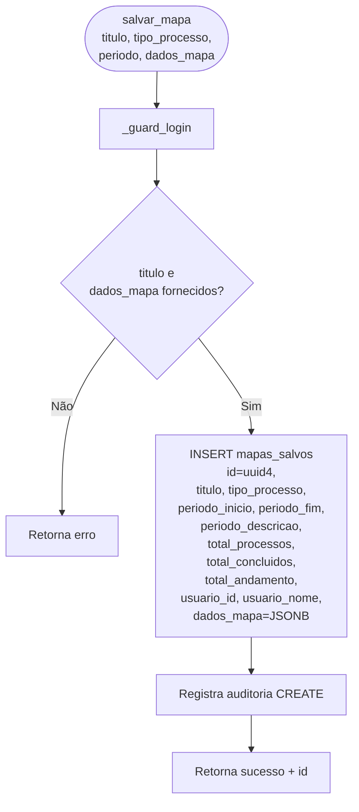
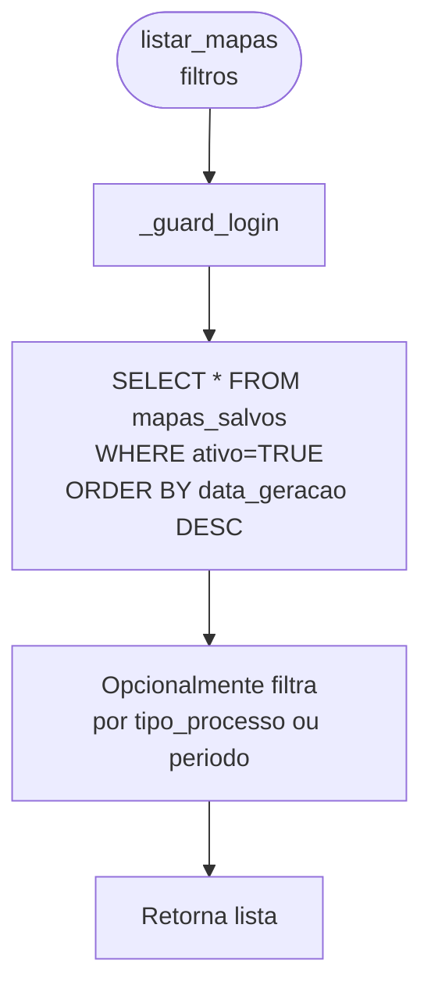
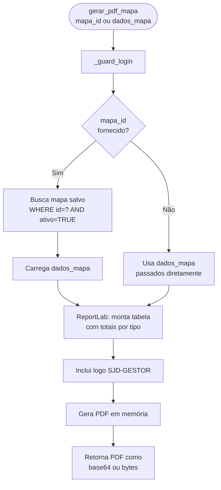
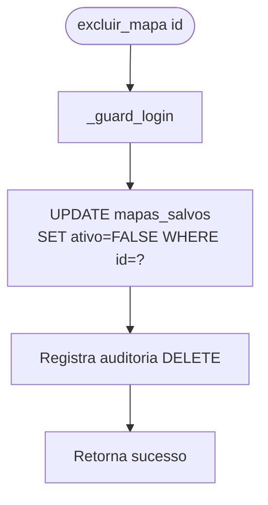

# Flowchart — Módulo mapas

> Gerado pelo Arqueólogo em 2026-05-12
> Fonte: `app/routers/mapas.py`

---

## Fluxo: Gerar Mapa (`gerar_mapa`)

```mermaid
flowchart TD
    A([gerar_mapa\ntipo_processo, periodo_inicio,\nperiodo_fim]) --> B[_guard_login]
    B --> C{tipo_processo\n== 'COMPLETO'?}
    C -- Sim --> D[Conta totais para TODOS\nos tipos de processo]
    C -- Não --> E[Filtra por tipo_processo\nespecífico]
    D --> F[Algoritmo totais COMPLETO:\npara cada tipo_detalhe:\n  total = COUNT WHERE tipo=X\n  concluidos = COUNT WHERE tipo=X AND concluido=TRUE\n  andamento = total - concluidos]
    E --> G[Algoritmo totais simples:\n  total = COUNT WHERE tipo=tipo_processo\n  concluidos = COUNT WHERE tipo=X AND concluido=TRUE\n  andamento = total - concluidos]
    F --> H[Monta dados_mapa JSONB:\n{tipo: {total, concluidos, andamento}}]
    G --> H
    H --> I[Retorna dados do mapa\nsem salvar]
```

---

## Fluxo: Salvar Mapa (`salvar_mapa`)



---

## Fluxo: Listar Mapas Salvos (`listar_mapas`)



---

## Fluxo: Gerar PDF do Mapa (`gerar_pdf_mapa`)



---

## Fluxo: Excluir Mapa (`excluir_mapa`)



> 🟢 CONFIRMADO: dados_mapa armazenados como JSONB em mapas_salvos
> 🟡 INFERIDO: algoritmo de totais COMPLETO agrega todos os tipos individualmente
> 🔴 LACUNA: período de referência não é validado (periodo_inicio pode ser > periodo_fim)
