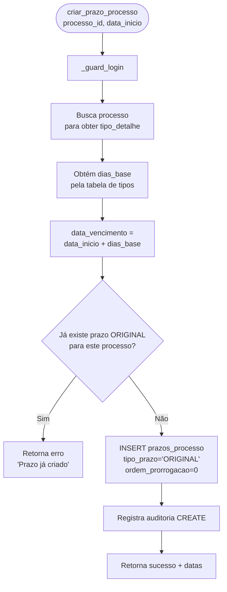
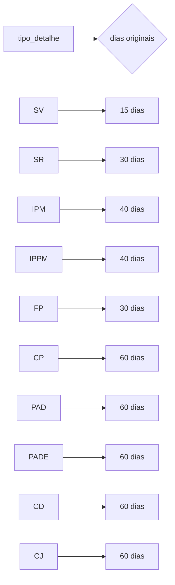
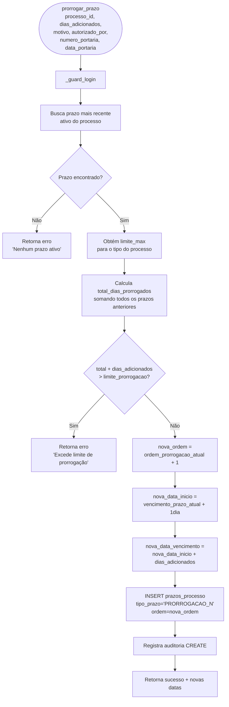
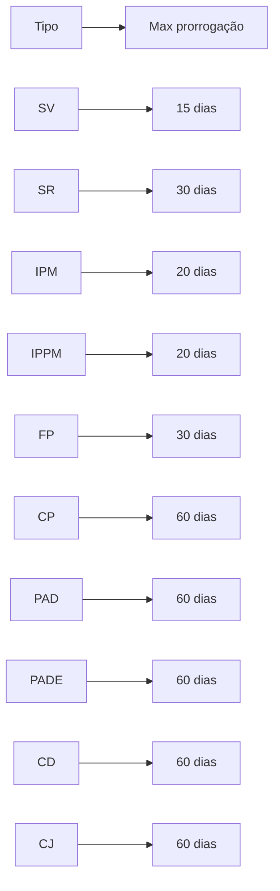
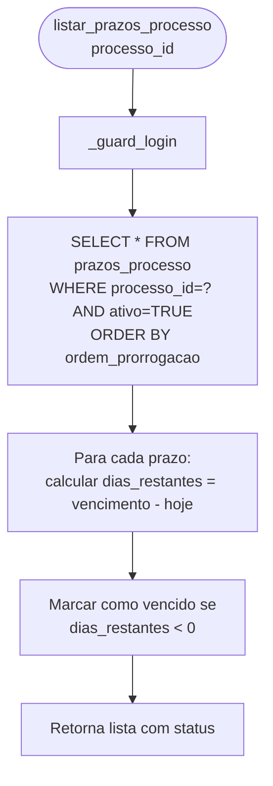
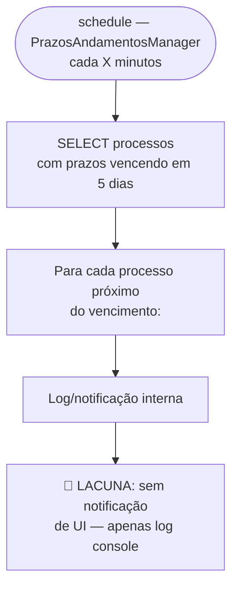

# Flowchart — Módulo prazos

> Gerado pelo Arqueólogo em 2026-05-12
> Fonte: `app/routers/prazos.py`, `app/services/prazos_andamentos.py`, `prazos_andamentos_manager.py`

---

## Fluxo: Criar Prazo Inicial (`criar_prazo_processo`)

---

## Tabela de Dias por Tipo (embutida no código)

---

## Fluxo: Prorrogar Prazo (`prorrogar_prazo`)

---

## Tabela de Limites de Prorrogação

---

## Fluxo: Listar Prazos do Processo (`listar_prazos_processo`)

---

## Fluxo: Verificação Periódica de Prazos

> 🟢 CONFIRMADO: cálculo de prorrogação com limite por tipo
> 🟡 INFERIDO: verificação de prazos via `schedule` em thread separada (main.py)
> 🔴 LACUNA: notificação de prazo vencendo não é visível ao usuário na UI
