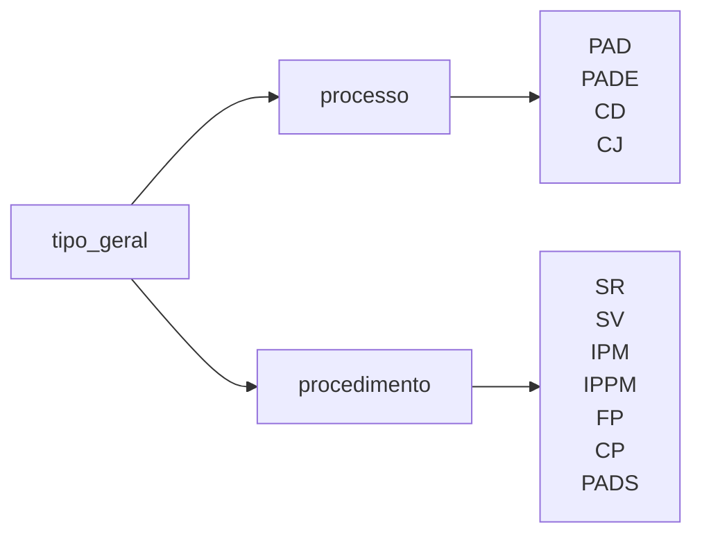
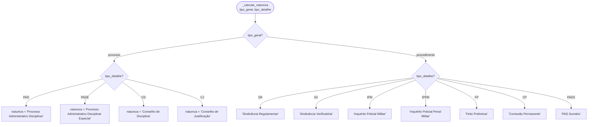
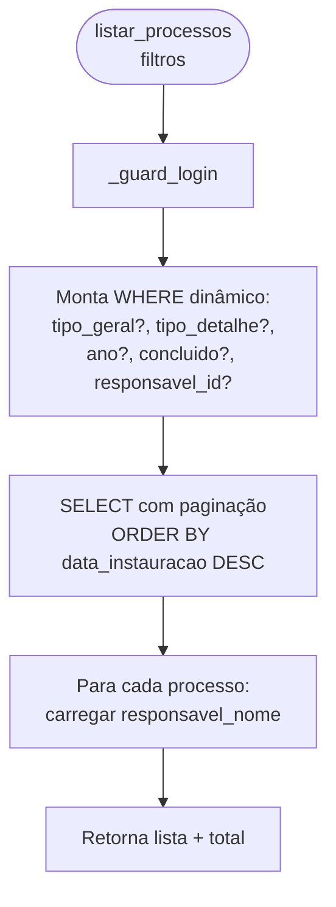
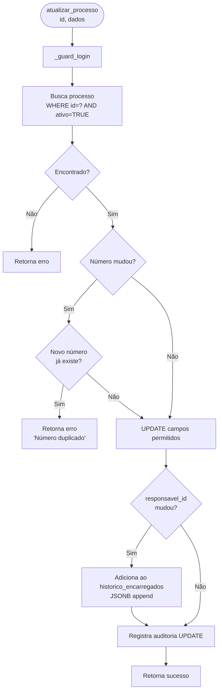
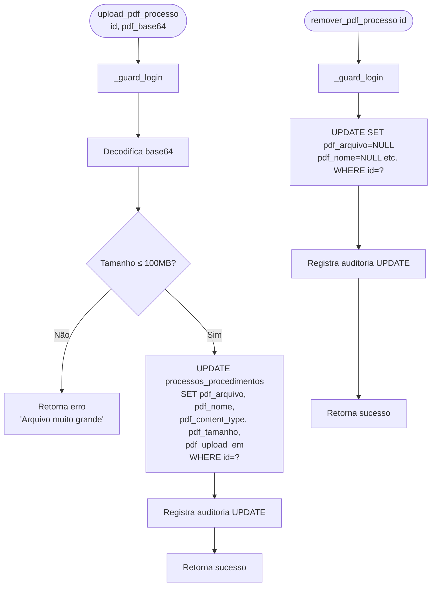
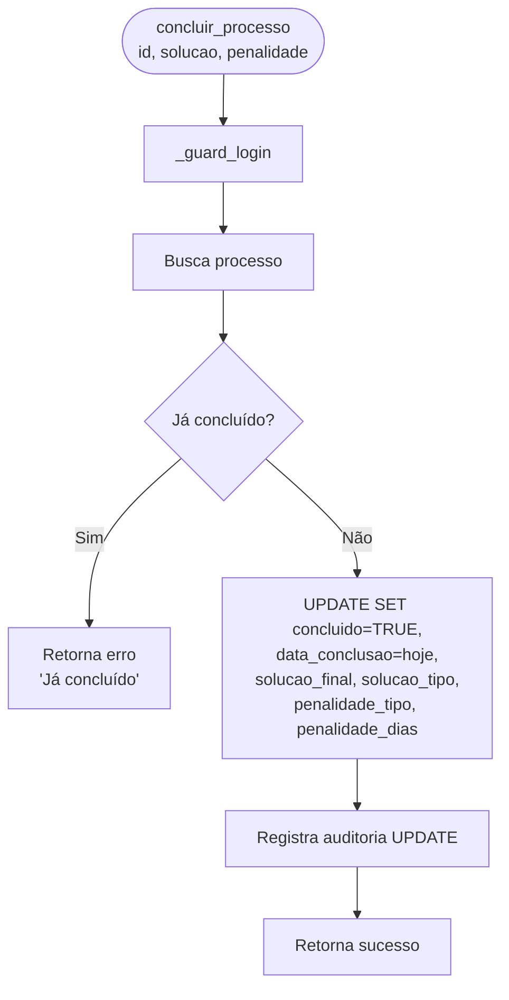

# Flowchart — Módulo processos

> Gerado pelo Arqueólogo em 2026-05-12
> Fonte: `app/routers/processos.py`, `app/processos.py`, `app/services/processos_service.py`

---

## Taxonomia de Tipos



---

## Fluxo: Criar Processo (`criar_processo`)

```mermaid
flowchart TD
    A([criar_processo\ndados]) --> B[_guard_login]
    B --> C{Campos obrigatórios:\ntipo_geral, tipo_detalhe,\ndocumento_iniciador, numero?}
    C -- Não --> D[Retorna erro\n'Campos obrigatórios']
    C -- Sim --> E{tipo_detalhe\nválido para tipo_geral?}
    E -- Não --> F[Retorna erro\n'Tipo inválido']
    E -- Sim --> G{numero+doc_iniciador+ano\njá existe?}
    G -- Sim --> H[Retorna erro\n'Número duplicado']
    G -- Não --> I[Calcula natureza_processo\nou natureza_procedimento]
    I --> J[Extrai ano_instauracao\nde data_instauracao]
    J --> K[INSERT processos_procedimentos\nid=uuid4, andamentos='[]']
    K --> L[Cria prazo inicial\n_criar_prazo_inicial]
    L --> M[Registra auditoria CREATE]
    M --> N[Retorna sucesso + id]
```

---

## Fluxo: Algoritmo natureza (`_calcular_natureza`)



---

## Fluxo: Listar Processos (`listar_processos`)



---

## Fluxo: Atualizar Processo (`atualizar_processo`)



---

## Fluxo: Upload/Remoção de PDF



---

## Fluxo: Concluir Processo (`concluir_processo`)



> 🟢 CONFIRMADO: processos usam soft delete (ativo=FALSE)
> 🟢 CONFIRMADO: PDF armazenado como BYTEA no banco (até 100MB)
> 🟢 CONFIRMADO: andamentos como JSONB array
> 🟡 INFERIDO: histórico_encarregados como JSONB append (sem tamanho máximo)
