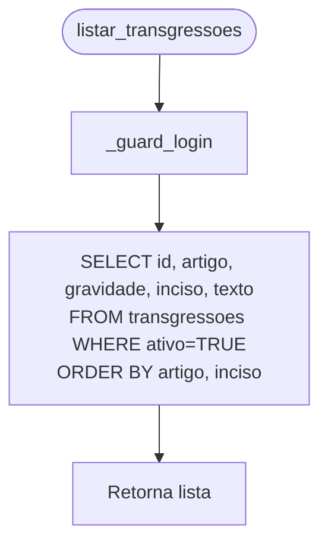
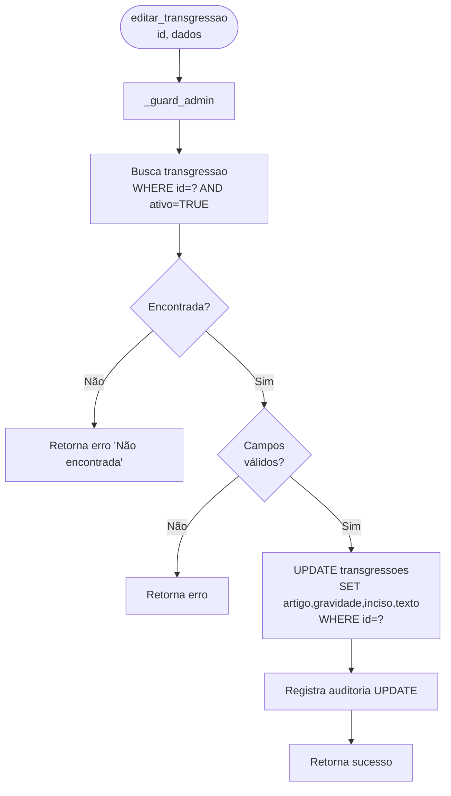
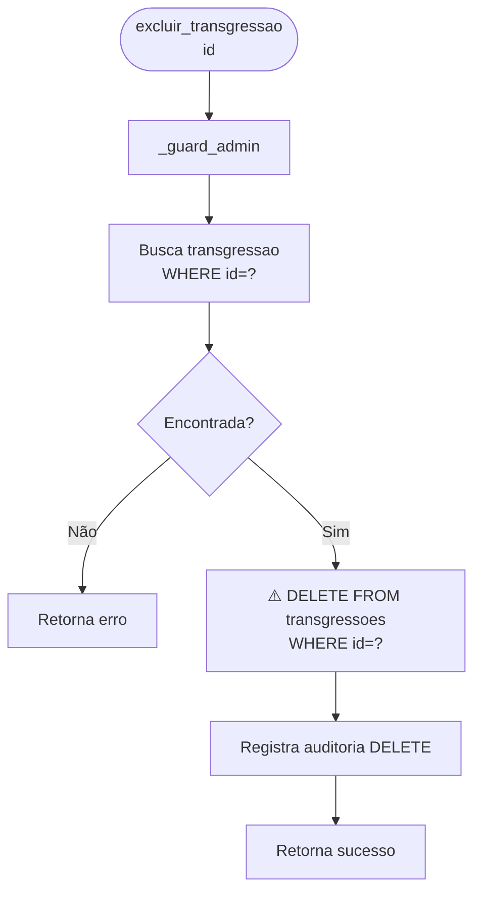

# Flowchart — Módulo rdpm

> Gerado pelo Arqueólogo em 2026-05-12
> Fonte: `app/routers/rdpm.py`, `app/rdpm.py`

---

## Fluxo: Listar Transgressões



---

## Fluxo: Adicionar Transgressão

```mermaid
flowchart TD
    A([adicionar_transgressao\ndados]) --> B[_guard_admin]
    B --> C{artigo, gravidade,\ntexto preenchidos?}
    C -- Não --> D[Retorna erro\n'Campos obrigatórios']
    C -- Sim --> E{gravidade IN\n'Leve','Média','Grave'?}
    E -- Não --> F[Retorna erro\n'Gravidade inválida']
    E -- Sim --> G[gravidade.title()]
    G --> H[INSERT INTO transgressoes\nid=SERIAL auto-incremento]
    H --> I[Registra auditoria CREATE]
    I --> J[Retorna sucesso + id]
```

---

## Fluxo: Editar Transgressão



---

## Fluxo: Excluir Transgressão ⚠️ HARD DELETE



> ⚠️ **CRÍTICO para migração**: único módulo com HARD DELETE.
> Risco: se transgressão estiver referenciada em `pm_envolvido_rdpm` ou `procedimentos_indicios_rdpm`, a FK protegerá em produção mas o código não valida isso antes de deletar.

---

## Fluxo: Listar por Gravidade (`listar_transgressoes_por_gravidade`)

```mermaid
flowchart TD
    A([listar_transgressoes_por_gravidade]) --> B[_guard_login]
    B --> C[SELECT * FROM transgressoes WHERE ativo=TRUE\nORDER BY gravidade, artigo, inciso]
    C --> D[Agrupa por gravidade\nnuma estrutura: dict de listas]
    D --> E[Retorna: Leve=[...], Média=[...], Grave=[...]]
```

> 🟢 CONFIRMADO: id SERIAL INTEGER (não UUID) — diferente de todas outras tabelas
> 🟢 CONFIRMADO: hard delete exclusivo neste módulo
