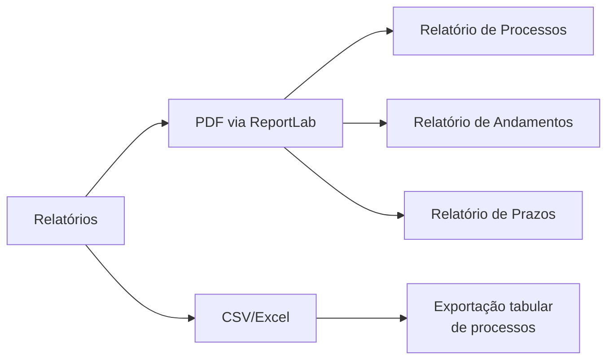
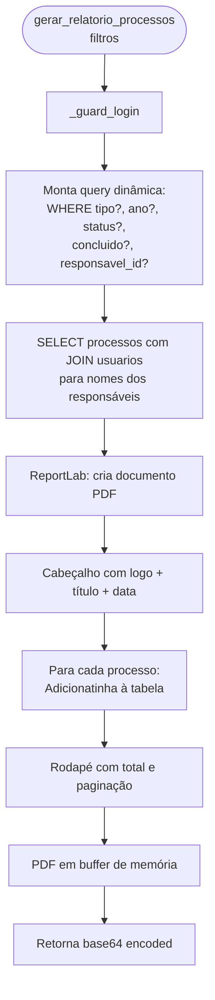
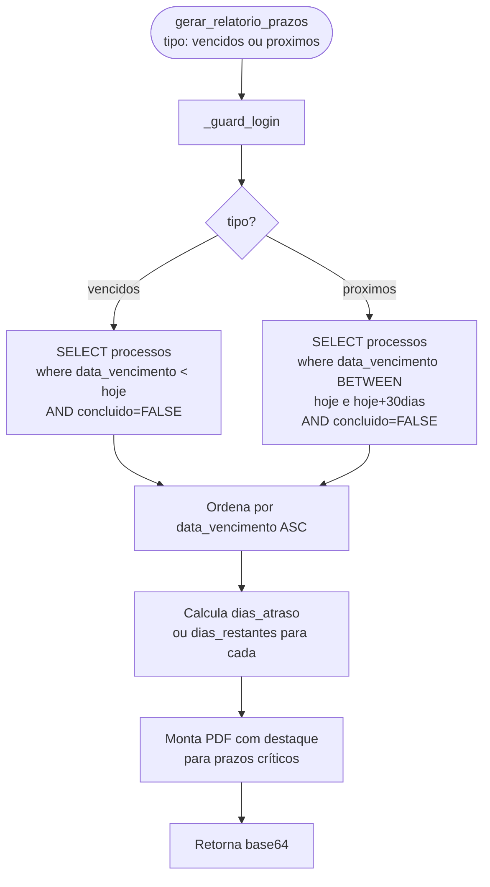
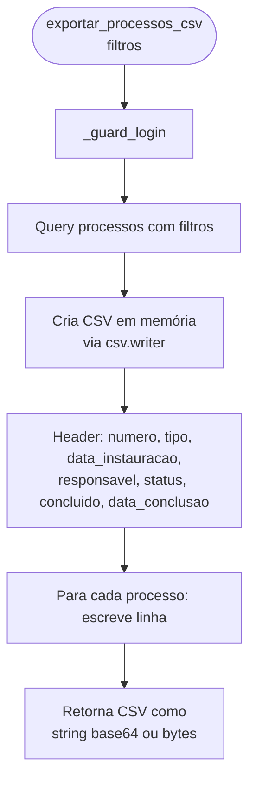
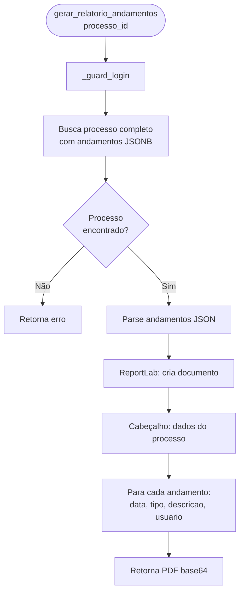
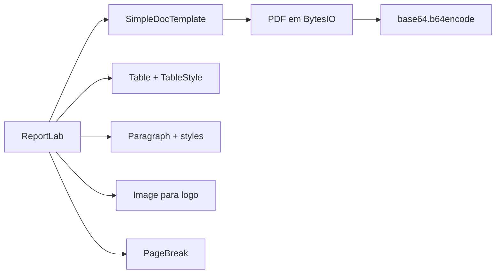

# Flowchart — Módulo relatorios

> Gerado pelo Arqueólogo em 2026-05-12
> Fonte: `app/routers/relatorios.py`

---

## Tipos de Relatórios Disponíveis

---

## Fluxo: Gerar Relatório de Processos (`gerar_relatorio_processos`)

---

## Fluxo: Gerar Relatório de Prazos Vencidos/Próximos

---

## Fluxo: Exportar CSV (`exportar_processos_csv`)

---

## Fluxo: Relatório de Andamentos por Processo

---

## Componentes ReportLab Utilizados

> 🟢 CONFIRMADO: todos os PDFs gerados em memória (BytesIO), retornados como base64
> 🟡 INFERIDO: logo carregada de `web/static/images/SJD-GESTOR.ico` ou equivalente PNG
> 🔴 LACUNA: sem paginação no relatório de andamentos para processos com muitos andamentos
