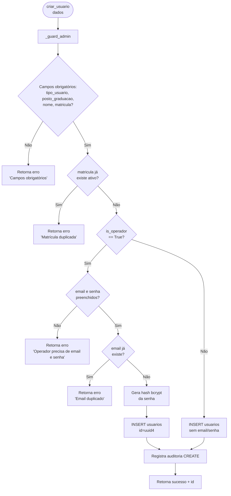
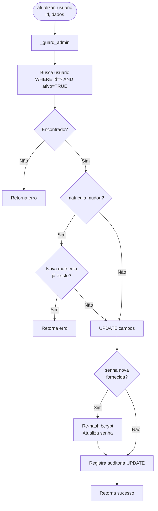
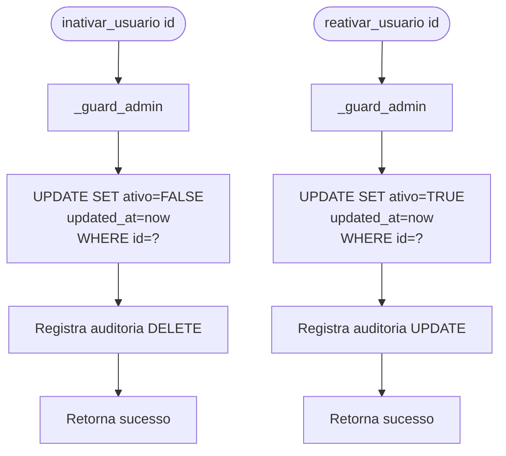
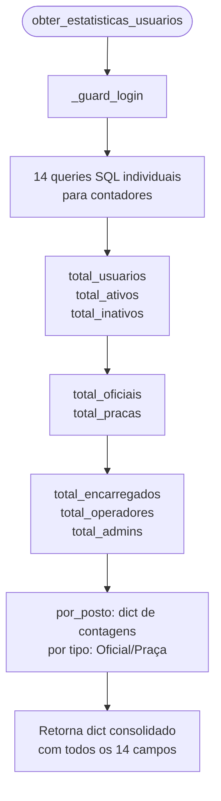
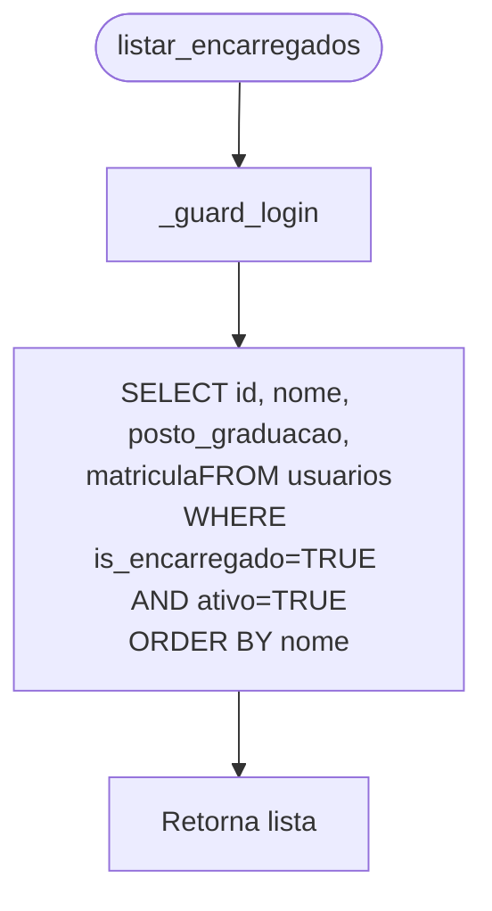
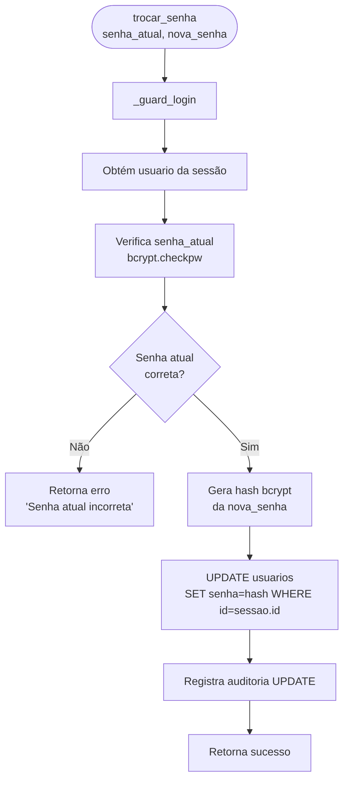

# Flowchart — Módulo usuarios

> Gerado pelo Arqueólogo em 2026-05-12
> Fonte: `app/routers/usuarios.py`, `app/services/usuarios.py`

---

## Fluxo: Criar Usuário (`criar_usuario`)

---

## Fluxo: Atualizar Usuário (`atualizar_usuario`)

---

## Fluxo: Inativar/Reativar Usuário

---

## Fluxo: Estatísticas (`obter_estatisticas_usuarios`)

---

## Fluxo: Listar Encarregados (`listar_encarregados`)

---

## Fluxo: Trocar Senha Própria (`trocar_senha`)

> 🟢 CONFIRMADO: inconsistência no hash do legado — criar_usuario usa bcrypt,
> atualizar_usuario usa SHA-256 e pode haver senhas SHA-256 no banco. Na migração,
> atualizar_usuario deve salvar bcrypt e o login deve manter detecção por prefixo/comprimento.
> 🟢 CONFIRMADO: soft delete via ativo=FALSE
