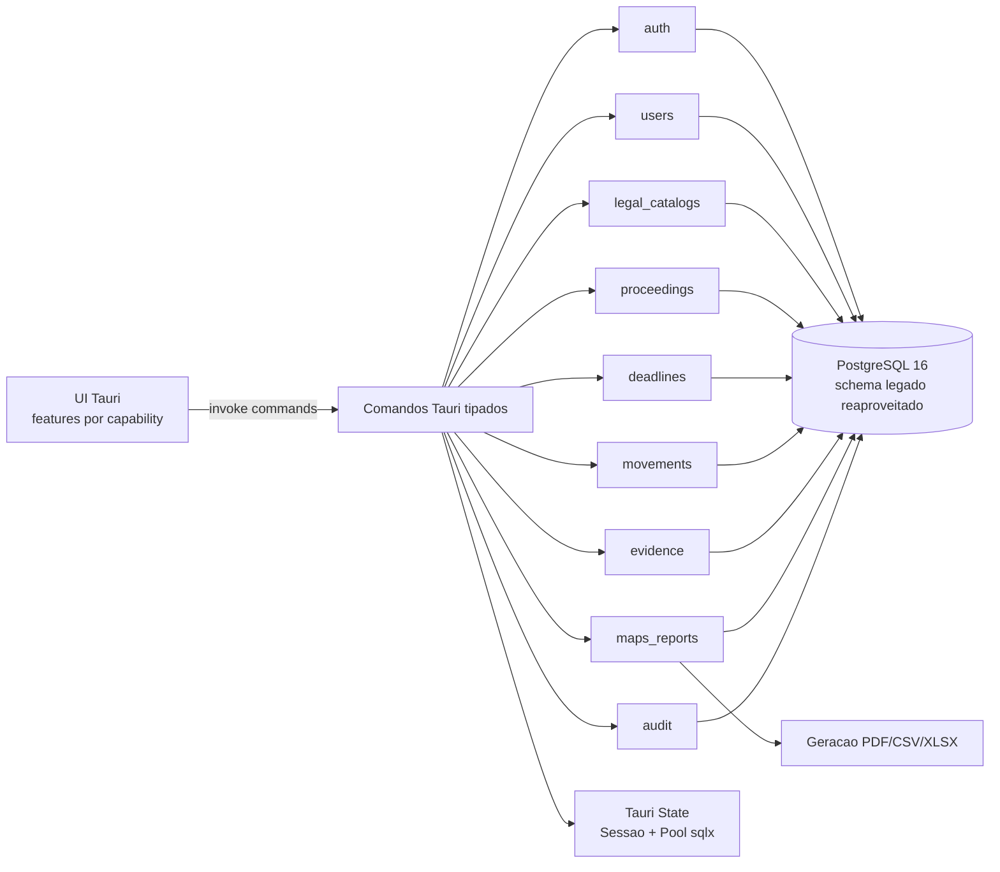

# Target Architecture

> Arquitetura alvo do sistema novo, respeitando `paradigm_decision.md`, `migration_strategy.md` e `topology_decision.md`.

## Visao geral

O sistema alvo e uma aplicacao desktop Rust/Tauri com frontend web embarcado, comandos Tauri tipados e PostgreSQL reaproveitado via sqlx. A arquitetura e um monolito desktop por vertical slices de capability, sem mensageria, sem microservicos e sem DI/container pesado. A migracao segue Big Bang controlado com Parallel Run de validacao para provar paridade em CRUDs, listagens, mapas, relatorios, estatisticas e regras disciplinares.

## Diagrama (Mermaid)



## Componentes

| Componente | Tipo | Responsabilidade | Origem |
|---|---|---|---|
| UI Tauri | UI | Telas modernizadas por funcionalidade, mantendo capacidades do legado | `web/*.html`, `web/static/js/*` |
| Commands Tauri | API local | Borda IPC tipada entre UI e Rust | substitui Eel; ver `discard_log.md` |
| AppState | Servico | Sessao atual, pool sqlx, configuracao | `main.py` sessao global + DB init |
| `auth` | Capability | Login, logout, usuario logado, upgrade SHA-256→bcrypt | BR-MIGRAR-001/002 |
| `users` | Capability | Gestao de policiais/operadores, RBAC admin escrita/leitura comum | BR-MIGRAR-003/009 |
| `legal_catalogs` | Capability | Crimes, municipios, RDPM, Art.29 | BR-MIGRAR-004/005/006 |
| `proceedings` | Capability | Processos/procedimentos, PDF, papeis, penalidades, transicoes | BR-MIGRAR-007/008/016 |
| `deadlines` | Capability | Prazos, prorrogacoes, dashboard de prazos | BR-MIGRAR-010 |
| `movements` | Capability | Andamentos em JSONB e normalizacao de registros legados | BR-MIGRAR-011 |
| `evidence` | Capability | Indicios por PM envolvido e tabelas relacionadas | BR-MIGRAR-012 |
| `maps_reports` | Capability | Mapas, relatorios, PDF/CSV/XLSX e estatisticas | BR-MIGRAR-013/014 |
| `audit` | Capability | Registro e consulta de auditoria | BR-MIGRAR-015 |
| PostgreSQL | DB | Banco operacional reaproveitado | `data-dictionary.md`, `erd-complete.md` |

## Bounded contexts

### BC-01: Identity & Access
- **Responsabilidade**: autenticacao, sessao, usuario logado, perfis e RBAC.
- **Justificativa**: regras de login e permissao mudam juntas e protegem todos os comandos.
- **Componentes internos**: `auth`, parte de `users`, `AppState`.

### BC-02: Personnel
- **Responsabilidade**: cadastro e consulta de usuarios/PMs, encarregados e operadores.
- **Justificativa**: usuarios sao tanto operadores quanto entidades referenciadas em processos.
- **Componentes internos**: `users`.

### BC-03: Legal Catalogs
- **Responsabilidade**: crimes/contravencoes, municipios/distritos, RDPM e Art.29.
- **Justificativa**: catalogos compartilham leitura ampla, escrita admin, validacoes legais e alimentam indicios/processos.
- **Componentes internos**: `legal_catalogs`.

### BC-04: Disciplinary Proceedings
- **Responsabilidade**: processos/procedimentos, papeis, penalidade, PDF, conclusao, reabertura e soft delete.
- **Justificativa**: core do dominio e principal fronteira transacional.
- **Componentes internos**: `proceedings`.

### BC-05: Procedural Tracking
- **Responsabilidade**: prazos e andamentos.
- **Justificativa**: prazos tem tabela propria e calculo temporal; andamentos vivem em JSONB, mas ambos acompanham processo.
- **Componentes internos**: `deadlines`, `movements`.

### BC-06: Evidence
- **Responsabilidade**: indicios por PM envolvido, crimes, RDPM, Art.29 e categorias.
- **Justificativa**: regras de upsert destrutivo e vínculos por PM justificam fronteira propria.
- **Componentes internos**: `evidence`.

### BC-07: Reporting
- **Responsabilidade**: mapas mensais, relatorios, estatisticas e exportacoes.
- **Justificativa**: capacidade de leitura/agregacao com comparacao obrigatoria em Parallel Run.
- **Componentes internos**: `maps_reports`.

### BC-08: Audit
- **Responsabilidade**: registrar e consultar auditorias.
- **Justificativa**: preocupa todos os comandos de escrita, mas tem leitura admin propria.
- **Componentes internos**: `audit`, helper compartilhado.

## Decisoes arquiteturais

### AD-01: Monolito desktop Tauri por vertical slices
- **Decisao**: organizar backend Rust por capabilities, cada uma com `commands.rs`, `domain.rs`, `repository.rs` e `dto.rs` quando necessario.
- **Alternativas descartadas**: copiar camadas globais do legado; microservicos; plugin architecture.
- **Justificativa**: maximiza Rust idiomatico sem complexidade desnecessaria.
- **Rastreabilidade**: `topology_decision.md`, `paradigm_decision.md`.

### AD-02: PostgreSQL reaproveitado via sqlx
- **Decisao**: manter schema existente e mapear com sqlx; evitar mudancas destrutivas de schema na primeira versao.
- **Alternativas descartadas**: novo schema completo; ORM pesado.
- **Justificativa**: brief pede PostgreSQL/sqlx e paridade com banco existente.
- **Rastreabilidade**: `data-dictionary.md`, `erd-complete.md`.

### AD-03: RBAC restritivo na borda de comando
- **Decisao**: perfil comum somente leitura; criacao/edicao/remocao exigem admin.
- **Alternativas descartadas**: paridade estrita com legado permitindo escrita comum em processos.
- **Justificativa**: decisao humana no Curator.
- **Rastreabilidade**: `target_business_rules.md` BR-MIGRAR-003.

### AD-04: Resposta e erros tipados
- **Decisao**: padronizar `Result<T, AppError>` no Rust e DTOs de resposta coerentes para UI.
- **Alternativas descartadas**: manter `sucesso/mensagem` e `success/error` simultaneamente.
- **Justificativa**: mudança de paradigma e descarte de padrao duplo.
- **Rastreabilidade**: `discard_log.md` BR-DESCARTAR-008.

## Honra ao paradigma escolhido

- **Paradigma alvo**: Rust idiomatico com ownership, tipagem forte, structs/enums, erros estruturados e I/O controlado.
- **Como a arquitetura honra esse paradigma**:
  - Validacoes ficam em `domain.rs`, nao apenas na UI.
  - Estados como `TipoProcesso`, `SolucaoTipo`, `PenalidadeTipo`, `Perfil`, `OperacaoAuditoria` viram enums.
  - SQL fica isolado em repositories sqlx.
  - Sessao global vira `AppState` gerenciado pelo Tauri.
  - Erros deixam de ser dicts flexiveis e viram `AppError`.

## Honra a topologia escolhida

Topologia escolhida: **opcao 2 — vertical slices por capability**.

Arvore alvo:

```text
src-tauri/src/
├── main.rs
├── app_state.rs
├── error.rs
├── db/
├── auth/
├── users/
├── legal_catalogs/
├── proceedings/
├── deadlines/
├── movements/
├── evidence/
├── maps_reports/
└── audit/
ui/src/features/
├── auth/
├── users/
├── catalogs/
├── proceedings/
├── deadlines/
├── evidence/
├── maps-reports/
└── audit/
```

## Bordas com o legado durante a migracao

- Nao ha roteamento Strangler. O legado roda separado para Parallel Run de validacao.
- Banco PostgreSQL pode ser clonado para homologacao; cutover so ocorre apos smoke tests e comparacao.
- Dados existentes sao lidos diretamente pelo novo app, com fallback para campos JSON/TEXT legados.

## Notas

- Se houver duvida tecnica sobre Tauri, sqlx, Rust ou PostgreSQL, consultar Context7 conforme `migration_brief.md`.
