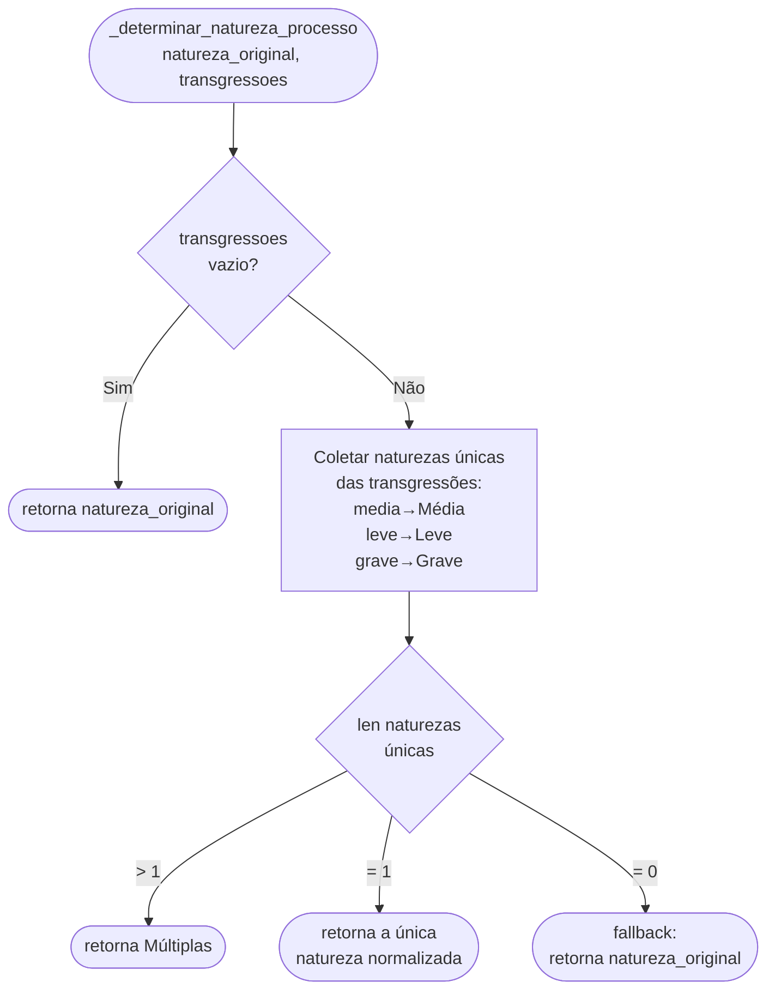
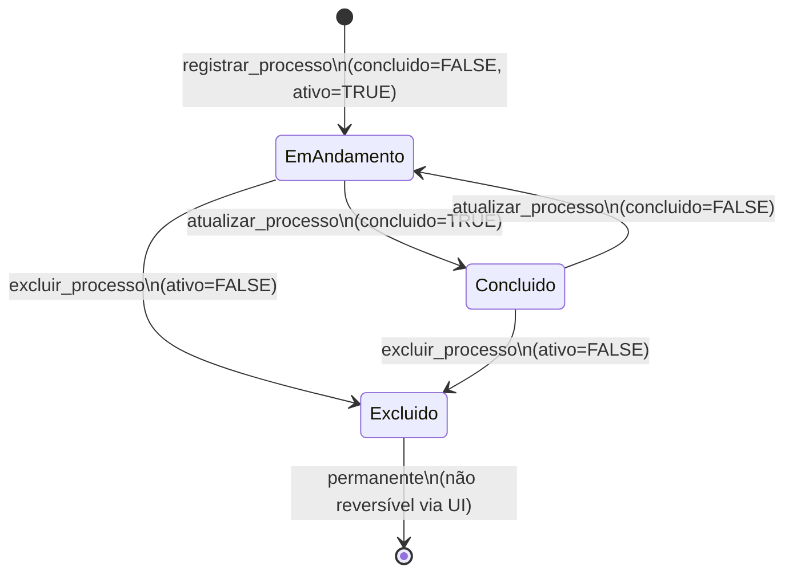
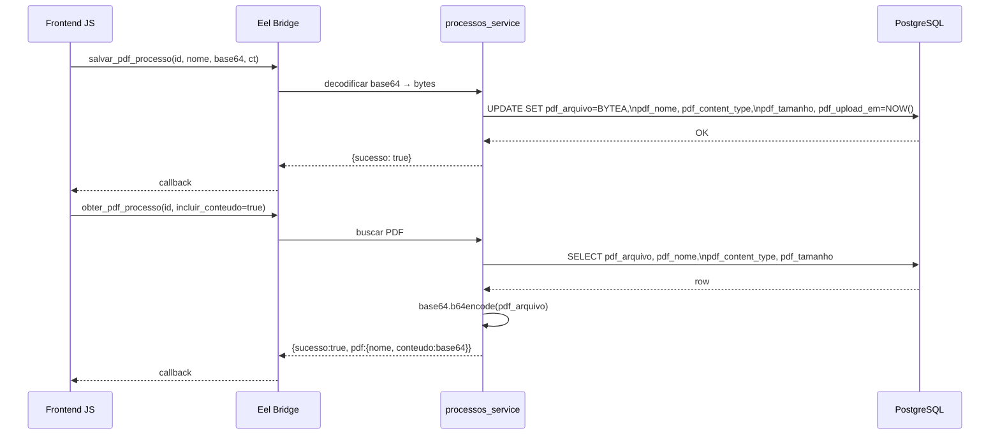

# Processos e Procedimentos — Fluxos Detalhados

## Fluxo 1 — Registrar Processo (passo a passo)

```mermaid
flowchart TD
    A([Início]) --> B[guard_login]
    B --> C{tipo_geral=processo\ne tipo_detalhe\nIN PAD/CD/CJ?}
    C -- Sim --> D[responsavel_id=NULL\nresponsavel_tipo=NULL]
    C -- Não --> E[usa responsavel_id\nfornecido]
    D --> F[Resolver tipos:\npresidente, interrogante,\nescrivao_processo]
    E --> F
    F --> G[Normalizar penalidade_tipo\nPrisão→Prisao\nDetenção→Detencao\nRepreensão→Repreensao]
    G --> H{solucao_tipo\n!= Punido?}
    H -- Sim --> I[penalidade_tipo=NULL\npenalidade_dias=NULL]
    H -- Não --> J{penalidade_tipo\nNOT IN\nPrisao/Detencao?}
    I --> K[Converter nome_vitima\npara JSON array]
    J -- Sim --> L[penalidade_dias=NULL]
    J -- Não --> K
    L --> K
    K --> M[Calcular ano_instauracao\na partir de data_instauracao]
    M --> N{Verificar unicidade:\nnumero+doc_iniciador+\ntipo_detalhe+local_origem\n+ano}
    N -- Duplicado --> O([Erro: número já existe])
    N -- OK --> P[gerar UUID\nprocesso_id]
    P --> Q[INSERT processos_procedimentos\n40+ campos]
    Q --> R{pms_envolvidos\nnão vazio?}
    R -- Sim --> S[INSERT procedimento_pms_envolvidos\npor PM]
    R -- Não --> T[registrar_auditoria CREATE]
    S --> T
    T --> U[criar prazo automático\nvia prazos_andamentos_manager]
    U --> V([{sucesso:true,\nprocesso_id:uuid}])
```

## Fluxo 2 — Determinar Natureza do Processo



## Fluxo 3 — Ciclo de Vida do Processo



## Fluxo 4 — Salvar e Recuperar PDF



## Fluxo 5 — Substituir Encarregado

```mermaid
flowchart TD
    A([substituir_encarregado\nid, novo_id, justificativa]) --> B[guard_login]
    B --> C[SELECT responsavel_id, nome atual\nFROM processos_procedimentos]
    C --> D[Montar objeto histórico:\n{id:antigo, nome:antigo,\ndata_substituicao:NOW(),\njustificativa:texto}]
    D --> E[UPDATE processos_procedimentos SET\nresponsavel_id = novo_id,\nhistorico_encarregados = historico || novo_objeto::jsonb]
    E --> F([{sucesso: true}])
```

## Fluxo 6 — Listar Processos com Filtros

```mermaid
flowchart TD
    A([listar_processos\nfiltros]) --> B[guard_login]
    B --> C[Construir WHERE dinâmico:\nativo=TRUE sempre]
    C --> D{tipo_geral\nfornecido?}
    D -- Sim --> E[AND tipo_geral=?]
    D -- Não --> F{tipo_detalhe\nfornecido?}
    E --> F
    F -- Sim --> G[AND tipo_detalhe=?]
    F -- Não --> H{concluido\nfornecido?}
    G --> H
    H -- Sim --> I[AND concluido=?]
    H -- Não --> J{responsavel_id\nfornecido?}
    I --> J
    J -- Sim --> K[AND responsavel_id=?]
    J -- Não --> L{ano\nfornecido?}
    K --> L
    L -- Sim --> M[AND ano_instauracao=?]
    L -- Não --> N[COUNT total;\nSELECT com OFFSET/LIMIT]
    M --> N
    N --> O([{sucesso:true,\nprocessos:[...],\ntotal:int}])
```

## Dependência entre fluxos

| Fluxo | Depende de |
|-------|-----------|
| Registrar | `_determinar_natureza_processo`, normalizar penalidade, prazo automático |
| Atualizar | Mesmas regras do Registrar, sem criar prazo |
| Obter | Buscar PMs envolvidos + indícios (JOIN) |
| Excluir | Registrar auditoria |
| Substituir Encarregado | JSONB append no campo `historico_encarregados` |
| Salvar PDF | base64 decode antes de armazenar BYTEA |
| Obter PDF | base64 encode ao extrair BYTEA |
