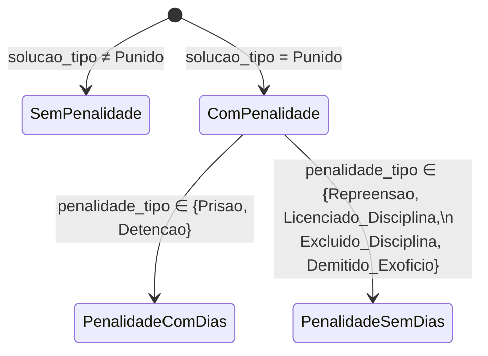
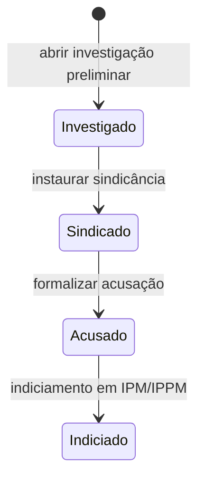
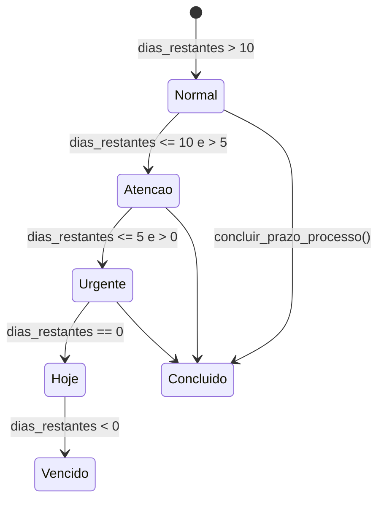
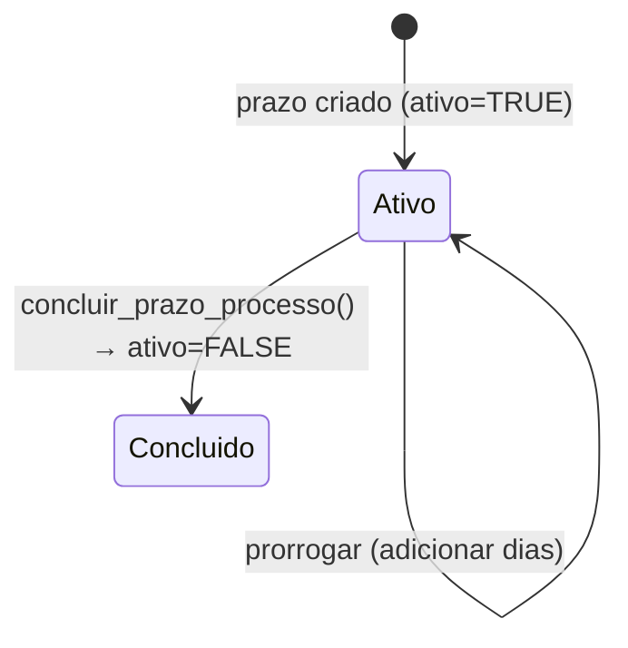
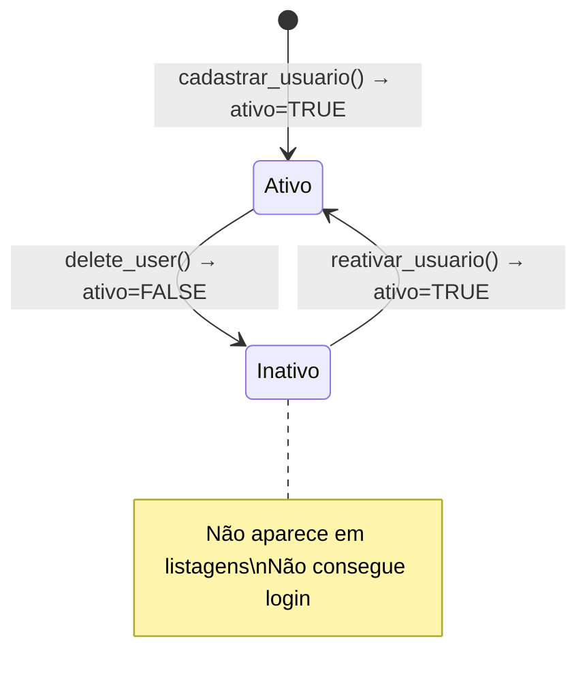
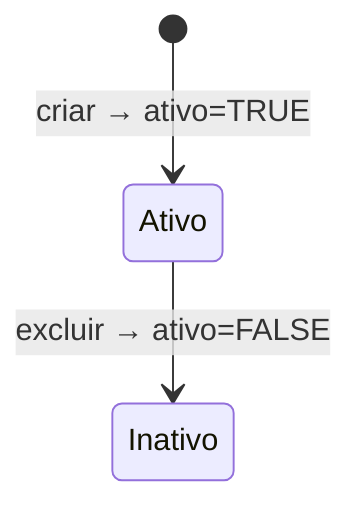

# Máquinas de Estado — Gestão P6

> Gerado pelo Detetive em 2026-05-12

---

## 1. Processo/Procedimento (`processos_procedimentos`)

### 1.1 Estado de ciclo de vida

🟢 CONFIRMADO — `app/processos.py`, `app/services/processos_service.py`

O estado de um processo é composto por dois booleanos ortogonais: `ativo` e `concluido`.

```mermaid
stateDiagram-v2
    [*] --> EmAndamento : criar processo (ativo=TRUE, concluido=FALSE)
    EmAndamento --> Concluido : registrar solução (concluido=TRUE)\n+ data_conclusao + solucao_tipo
    EmAndamento --> Excluido : excluir_processo() → ativo=FALSE
    Concluido --> Excluido : excluir_processo() → ativo=FALSE
    Excluido --> [*]

    state EmAndamento {
        note: solucao_tipo = NULL\nconcluido = FALSE
    }
    state Concluido {
        note: solucao_tipo ∈ {Punido, Absolvido, Arquivado}\n          ou {Homologado, Avocado, Arquivado}
    }
    state Excluido {
        note: ativo = FALSE\nNÃO aparece em listagens
    }
```

**Observações:**
- 🟢 Transição `Concluido → EmAndamento` existe no backend: `atualizar_processo(concluido=False)` é aceito em `processos_service.py:1783` (UPDATE sem restrição). Na migração Rust/Tauri, deve ser exposta na UI como reabertura de processo concluído (confirmado pelo usuário em `questions.md#16`) [Revisão: 🔴→🟢]
- Soft delete é sempre silencioso e auditado (registra operação DELETE na tabela `auditoria`)
- `concluido = TRUE` exige `solucao_tipo` preenchido (validado no frontend; backend não valida)

### 1.2 Solução por tipo de processo

| tipo_geral | Soluções possíveis |
|------------|-------------------|
| `processo` (PAD, PADE, CD, CJ) | Punido, Absolvido, Arquivado |
| `procedimento` (SR, SV, IPM, IPPM, FP, CP, PADS) | Homologado, Avocado, Arquivado |

🟢 CONFIRMADO — `web/static/js/procedure_form.js:1039`

---

## 2. Penalidade (`processos_procedimentos`)

🟢 CONFIRMADO — `app/services/processos_service.py:528`



**Tipos de penalidade:**

| Código interno | Exibição | Com dias? |
|----------------|----------|-----------|
| `Prisao` | Prisão | ✅ Sim |
| `Detencao` | Detenção | ✅ Sim |
| `Repreensao` | Repreensão | ❌ Não |
| `Licenciado_Disciplina` | Licenciado a bem da disciplina | ❌ Não |
| `Excluido_Disciplina` | Excluído a bem da disciplina | ❌ Não |
| `Demitido_Exoficio` | Demitido ex-ofício | ❌ Não |

> 🟡 INFERIDO: Os três últimos tipos (`Licenciado_Disciplina`, `Excluido_Disciplina`, `Demitido_Exoficio`) aparecem apenas para processos PAD/CJ — confirmados no código JS mas sem CHECK no banco.

---

## 3. Status do PM Envolvido (`procedimento_pms_envolvidos.status_pm`)

🟢 CONFIRMADO — `alembic/versions/0001_bootstrap_core_tables.py:193`

Texto livre (sem CHECK constraint). Valores observados no código:



**Nota:** As transições acima são 🟡 INFERIDAS. O banco não impõe FSM — qualquer valor pode ser inserido diretamente. No frontend, os quatro valores são exibidos como opções em select.

---

## 4. Status de Prazo (`prazos_processo` → calculado)

🟢 CONFIRMADO — `app/services/prazos_andamentos.py:443`

O status do prazo **não é armazenado** — é calculado em tempo real a partir de `data_vencimento` e a data atual.



**Fórmulas:**

```python
data_limite    = data_recebimento + timedelta(days=prazo_total)
dias_restantes = (data_limite - today).days

"Vencido há {abs(dias_restantes)} dias"  # dias_restantes < 0
"Vence hoje"                              # == 0
"Vence em {N} dias (URGENTE)"            # 0 < N <= 5
"Vence em {N} dias (ATENÇÃO)"            # 5 < N <= 10
"Vence em {N} dias"                      # N > 10
```

**Prorrogação:**
- `nova_data_vencimento = data_vencimento_atual + timedelta(dias_prorrogacao)`
- Cada prorrogação registra: `numero_portaria`, `data_portaria`, `ordem_prorrogacao`

---

## 5. Prazo: Ativo/Concluído

🟢 CONFIRMADO — `prazos_andamentos_manager.py`



Só existe um prazo ativo por processo por vez. Se não existe prazo ao prorrogar, um prazo inicial é criado automaticamente com base em `data_recebimento`.

---

## 6. Usuário (`usuarios`)

🟢 CONFIRMADO — `main.py:88`



🟢 CONFIRMADO pelo usuário (`questions.md#16`): a versão Rust/Tauri deve oferecer reativação de usuários desativados na UI.

---

## 7. Catalogo: Crimes, Infrações Art.29 (soft delete)

🟢 CONFIRMADO — módulos `catalogos`, `art29`



RDPM (`transgressoes`) usa **hard DELETE** — sem estado inativo.
